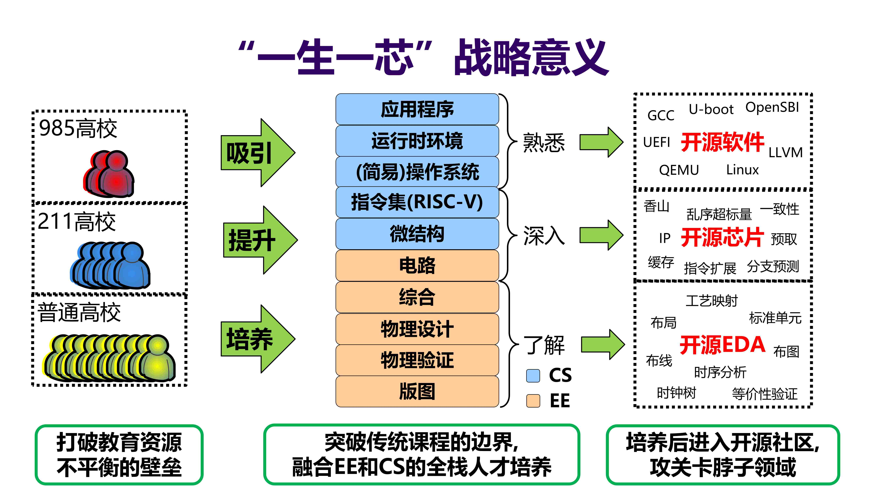
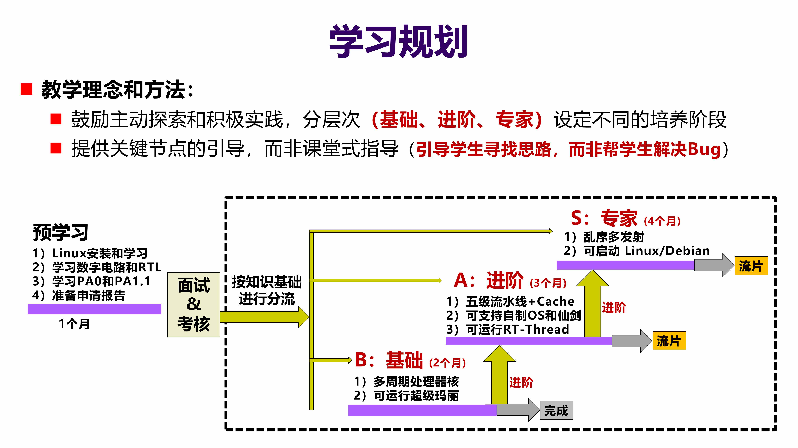

# 培养理念

在战略层面，“一生一芯”计划主要有三个目标。第一，打破教育资源不平衡的壁垒，让所有对处理器芯片设计感兴趣的学生，无论学校、年级、专业和基础，都有机会参与到处理器芯片的学习中，这对提升我国高校处理器芯片教育的普及有着非常重要且积极的意义。第二，突破传统课程的边界，尝试构建融合EE和CS的全栈人才培养方案。“一生一芯”计划的核心是构建一套软硬件协同、并打通前后端全链条的处理器芯片教学流程，让学生不仅懂得如何用代码设计处理器芯片，而且要理解程序如何在自己设计的处理器芯片上运行，同时还要了解处理器芯片的代码如何转变成可流片版图。第三，鼓励参加计划的学生进入软硬件开源社区和企业，努力攻克我国目前亟需解决的各个卡脖子领域，同时也将这些领域的成果沉淀到教学方案中，吸引更多学生参与“一生一芯”计划，实现良性的正向循环。

在教学层面，“一生一芯”计划首先是坡度低，项目团队按照处理器芯片教学的难度将培训流程划分为多个阶段，其中预学习阶段的引入将提升零基础学生的学习积极性，从而使他们能够相对平滑地过渡到处理器芯片的正式学习中，而且每个阶段均设置了相应的游戏运行目标，增加趣味性的同时也能激励学生去不断探索设计和实现功能更强大的处理器芯片。第二是高标准，不仅要求学生理解软件程序是如何一步步在硬件电路上运行的，还要锻炼学生独立解决未知问题的能力，助教只提供对关键节点的引导，鼓励主动探索找到问题的解决方案。

