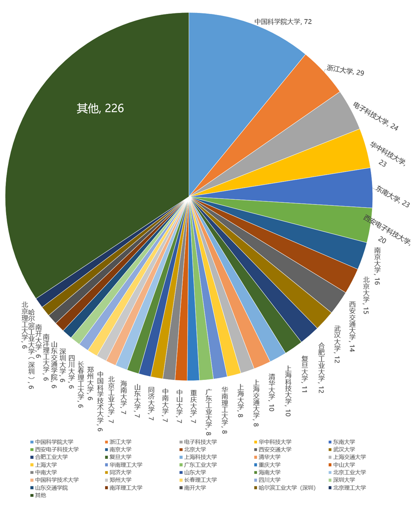
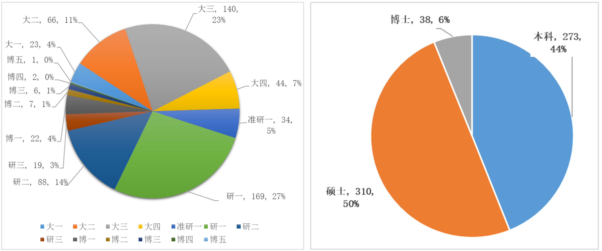

# 第三期”一生一芯“报名情况简析

## 报名总数

**报名总数**：**760人**，其中**在校生是“一生一芯”的主力**，共 **625**人，占比**82%**；较多已毕业学生对芯片感兴趣盖**168**所高校（含国外**30**所）                 

## 年级分布

**本硕博各年级均有分布，其中**本科生占比 **44%**，硕士 **50%**，博士 **6%**，**按细分来看**，研一（**27%**），大三（**23%**），研二（**14%**），大二（**11%**）

