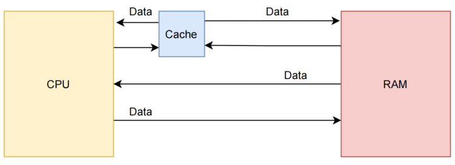
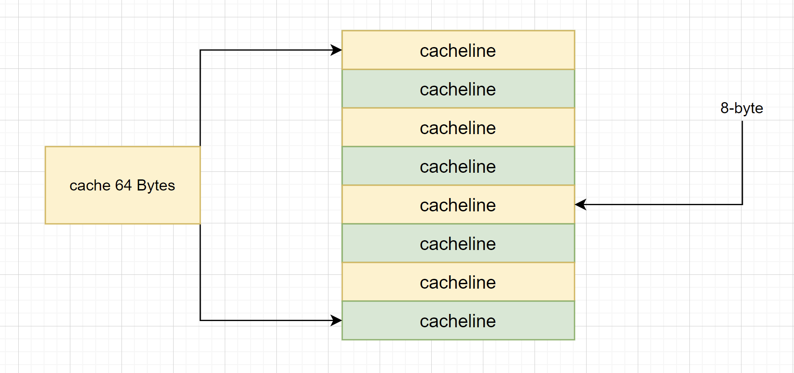
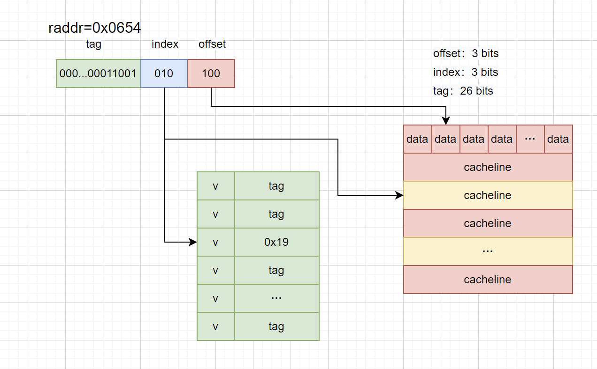
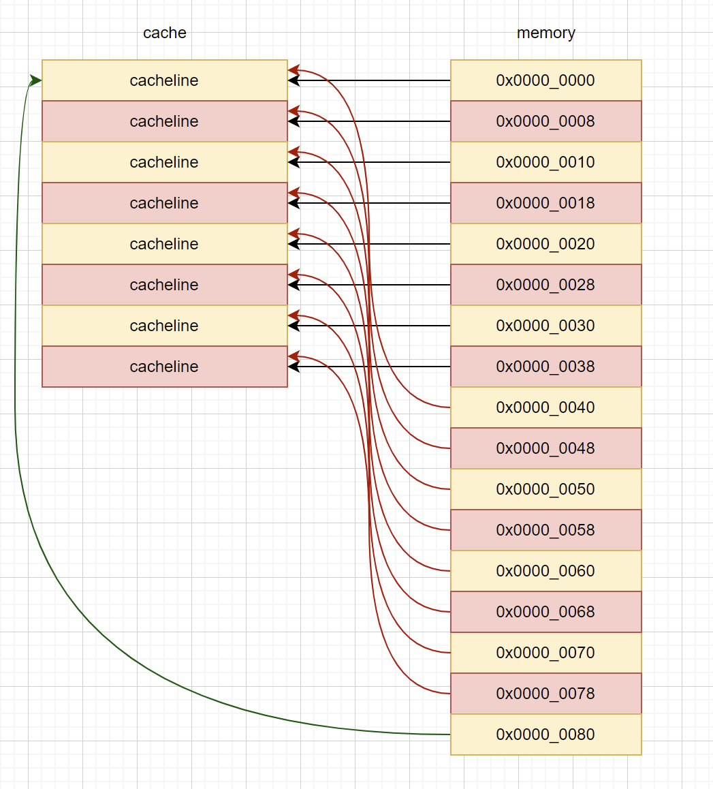
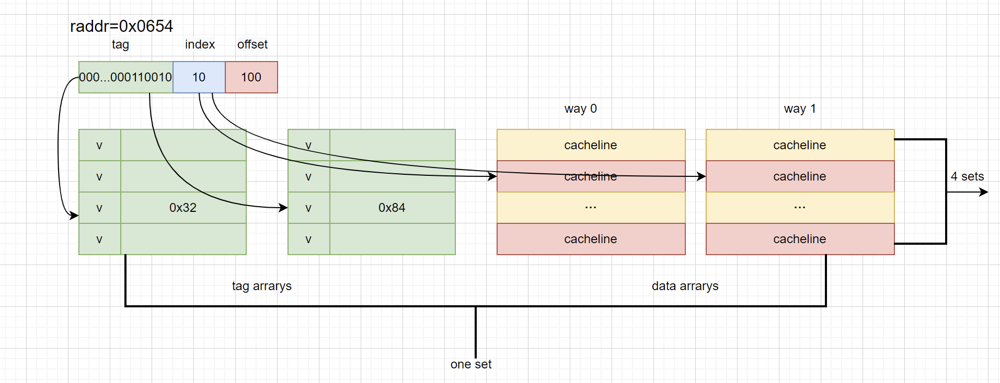
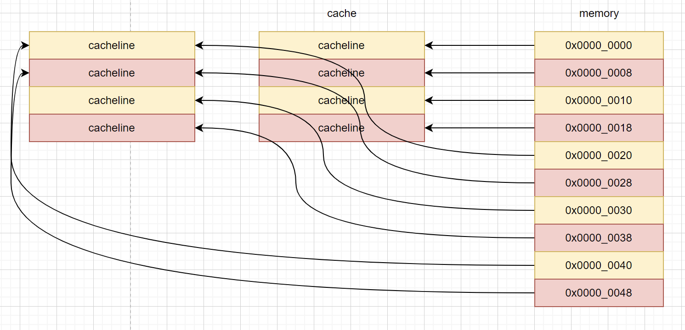
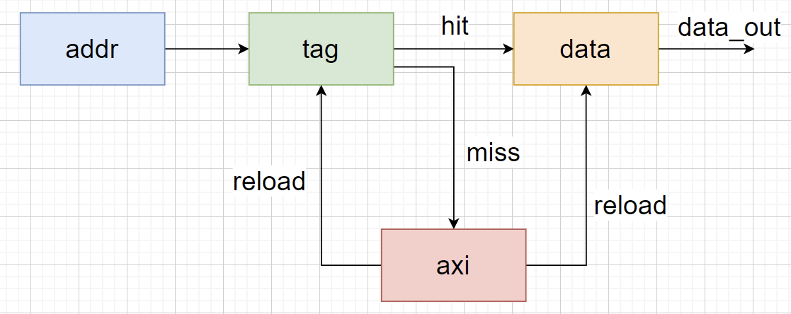
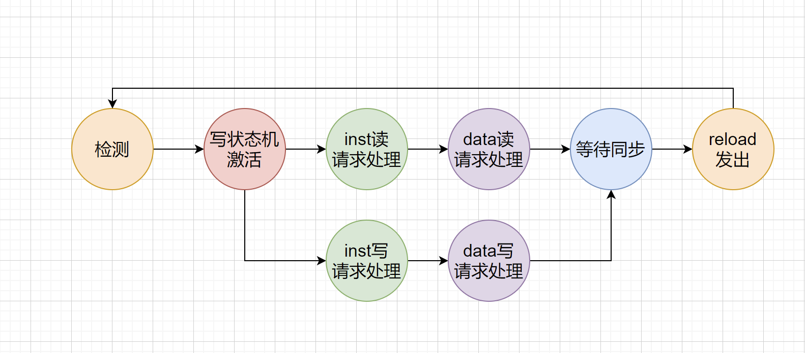

## Cache简介

> #### info::视频录播和课件
> * 录播 - [性能和缓存](https://www.bilibili.com/video/BV1FY41127tA/)
> * 课件 - [性能和缓存](https://ysyx.oscc.cc/slides/2205/19.html#/)

Cache指的是高速缓存简称缓存，原始意义是指访问速度比一般随机存取存储器（RAM）快的一种RAM，通常它不像系统主存那样使用DRAM技术，而使用昂贵但较快速的SRAM技术。

在CPU中，Cache是介于内存和处理器之间的缓存，用于存放CPU即将可能使用的数据，当CPU要使用的数据在Cache中取到时，便不再需要到内存去存取数据，从而减少处理器访问内存的次数。
提供“缓存”的目的是为了让数据访问的速度适应CPU的处理速度，由于CPU的运行速度远快于存储器的存储速度，当处理器通过内存存取一次数据将耗费数十个时钟周期，而处理器访问Cache则只需要一个或者几个时钟周期，所以Cache的出现极大的减小了CPU运行速度和存储速度的差距。设想一下一个主频2GHz的4-way超标量处理器访问一个100ns的DRAM, 在访问一次DRAM时间内，处理器内部可以执行800条指令，这是不可以接受的，所以就有了和处理器一样工艺制造的L1Cache，紧密耦合在处理器内，得以让处理器能够直接访问Cache得到数据。虽然Cache能极大的提升处理器的性能，但是在一块芯片中，Cache的容量大小一般只有1KB到32KB，而这相较于内存存储的几个GB甚至TB的数据来说，Cache的容量是微乎其微的,Cache只能缓存内存的一小部分数据，但是Cache依然能够让处理器取到大部分需要的数据，其中的原理是内存中“程序执行与数据访问的局域性行为”，即一定程序执行时间和空间内，被访问的代码集中于一部分，所以Cache中缓存的数据都是被近期访问过数据或者可能会被访问的数据，这样就使得Cache的命中率大大提高。

前面提到的Cache，称之为L1 Cache（第一级Cache）。我们在L1 Cache后面连接L2 Cache，在L2 Cache和主存之间连接L3 Cache。等级越高，速度越慢，容量越大。但是速度相比较主存而言，依然很快，但是本次一生一芯只需要完成L1Cache，且提供的大小暂定为8K，同时为了减小面积和改善后端物理设计结果，需要替换RAM。关于SoC对接要求请查看[第四期一生一芯计划仿真用SoC工程](https://github.com/OSCPU/ysyxSoC)，在CheckList中会提到共享RAM的规格，其具体原语句可在这里查看[带写掩码的单口RAM模型](https://github.com/OSCPU/ysyxSoC/blob/ysyx4/ysyx/ram/S011HD1P_X32Y2D128_BW.v)
## 直接映射缓存(Direct mapped cache)
我们继续引入一些cache相关的名词。cache的大小称之为cache size，代表cache可以缓存最大数据的大小。我们将cache平均分成相等的很多块，每一个块大小称之为cache line，其大小是cache line size。例如一个64 Bytes大小的cache。如果我们将64 Bytes平均分成64块，那么cache line就是1字节，总共64行cache line。如果我们将64 Bytes平均分成8块，那么cache line就是8字节，总共8行cache line。现在的硬件设计中，一般cache line的大小是4-128 Bytes。为什么没有1 byte呢？原因我们后面讨论。
我们假设下面的讲解都是针对64 Bytes大小的cache，并且cache line大小是8字节。我们可以类似把这块cache想想成一个数组，数组总共8个元素，每个元素大小是8字节。

现在我们考虑一个问题，CPU从0x0654地址读取一个字节，cache控制器是如何判断数据是否在cache中命中呢？cache大小相对于主存来说，可谓是小巫见大巫。所以cache肯定是只能缓存主存中极小一部分数据。我们如何根据地址在有限大小的cache中查找数据呢？现在硬件采取的做法是对地址进行散列（可以理解成地址取模操作）。我们接下来看看是如何做到的？

我们一共有8行cache line，cache line大小是8 Bytes。所以我们可以利用地址低3 bits（如上图地址红色部分）用来寻址8 bytes中某一字节，我们称这部分bit组合为offset。同理，8行cache line，为了覆盖所有行。我们需要3 bits（如上图地址蓝色部分）查找某一行，这部分地址部分称之为index。现在我们知道，如果两个不同的地址，其地址的bit3-bit5如果完全一样的话，那么这两个地址经过硬件散列之后都会找到同一个cache line。所以，当我们找到cache line之后，只代表我们访问的地址对应的数据可能存在这个cache line中，但是也有可能是其他地址对应的数据。所以，我们又引入tag array区域，tag array和data array一一对应。每一个cache line都对应唯一一个tag，tag中保存的是整个地址位宽去除index和offset使用的bit剩余部分（如上图地址绿色部分）。tag和index、offset三者组合就可以唯一确定一个地址了。因此，当我们根据地址中index位找到cache line后，取出当前cache line对应的tag，然后和地址中的tag进行比较，如果相等，这说明cache命中。如果不相等，说明当前cache line存储的是其他地址的数据，这就是cache缺失。在上述图中，我们看到tag的值是0x19，和地址中的tag部分相等，因此在本次访问会命中。由于tag的引入，因此解答了我们之前的一个疑问“为什么硬件cache line不做成一个字节？”。这样会导致硬件成本的上升，因为原本8个字节对应一个tag，现在需要8个tag，占用了很多内存。tag也是cache的一部分，但是我们谈到cache size的时候并不考虑tag占用的内存部分，我们在一生一芯中的tag是用寄存器reg来实现的。

我们可以从图中看到tag旁边还有一个valid bit，这个bit用来表示cache line中数据是否有效（例如：1代表有效；0代表无效）。当系统刚启动时，cache中的数据都应该是无效的，因为还没有缓存任何数据。cache控制器可以根据valid bit确认当前cache line数据是否有效。所以，上述比较tag确认cache line是否命中之前还会检查valid bit是否有效。只有在有效的情况下，比较tag才有意义。如果无效，直接判定cache缺失。

上面的例子中，cache size是64 Bytes并且cache line size是8 bytes。offset、index和tag分别使用3 bits、3 bits和26 bits（假设地址宽度是32 bits）。那么根据一生一芯提供的RAM，你的index、offset和tag应该如何划分呢？

## 直接映射缓存的优缺点
直接映射缓存在硬件设计上会更加简单，因此成本上也会较低。根据直接映射缓存的工作方式，我们可以画出主存地址0x00-0x88地址对应的cache分布图。

我们可以看到，地址0x00-0x3f地址处对应的数据可以覆盖整个cache。0x40-0x7f地址的数据也同样是覆盖整个cache。我们现在思考一个问题，如果一个程序试图依次访问地址0x00、0x40、0x80，cache中的数据会发生什么呢？首先我们应该明白0x00、0x40、0x80地址中index部分是一样的。因此，这3个地址对应的cache line是同一个。所以，当我们访问0x00地址时，cache会缺失，然后数据会从主存中加载到cache中第0行cache line。当我们访问0x40地址时，依然索引到cache中第0行cache line，由于此时cache line中存储的是地址0x00地址对应的数据，所以此时依然会cache缺失。然后从主存中加载0x40地址数据到第一行cache line中。同理，继续访问0x80地址，依然会cache缺失。这就相当于每次访问数据都要从主存中读取，所以cache的存在并没有对性能有什么提升。访问0x40地址时，就会把0x00地址缓存的数据替换。这种现象叫做cache颠簸（cache thrashing）。针对这个问题，我们引入多路组相连缓存。我们首先研究下最简单的两路组相连缓存的工作原理。
## 两路组相连缓存(Two-way set associative cache)
我们依然假设64 Bytes cache size，cache line size是8 Bytes。什么是路（way）的概念。我们将cache平均分成多份，每一份就是一路。因此，两路组相连缓存就是将cache平均分成2份，每份32 Bytes。如下图所示。

cache被分成2路，每路包含4行cache line。我们将所有索引一样的cache line组合在一起称之为组。例如，上图中一个组有两个cache line，总共4个组。我们依然假设从地址0x0654地址读取一个字节数据。由于cache line size是8 Bytes，因此offset需要3 bits，这和之前直接映射缓存一样。不一样的地方是index，在两路组相连缓存中，index只需要2 bits，因为一路只有4行cache line。上面的例子根据index找到第2行cache line（从0开始计算），第2行对应2个cache line，分别对应way 0和way 1。因此index也可以称作set index（组索引）。先根据index找到set，然后将组内的所有cache line对应的tag取出来和地址中的tag部分对比，如果其中一个相等就意味着命中。
因此，两路组相连缓存较直接映射缓存最大的差异就是：第一个地址对应的数据可以对应2个cache line，而直接映射缓存一个地址只对应一个cache line。那么这究竟有什么好处呢？
两路组相连缓存优缺点
两路组相连缓存的硬件成本相对于直接映射缓存更高。因为其每次比较tag的时候需要比较多个cache line对应的tag（某些硬件可能还会做并行比较，增加比较速度，这就增加了硬件设计复杂度）。为什么我们还需要两路组相连缓存呢？因为其可以有助于降低cache颠簸可能性。那么是如何降低的呢？根据两路组相连缓存的工作方式，我们可以画出主存地址0x00-0x4f地址对应的cache分布图。

我们依然考虑直接映射缓存一节的问题“如果一个程序试图依次访问地址0x00、0x40、0x80，cache中的数据会发生什么呢？”。现在0x00地址的数据可以被加载到way 1，0x40可以被加载到way 0。这样是不是就在一定程度上避免了直接映射缓存的尴尬境地呢？在两路组相连缓存的情况下，0x00和0x40地址的数据都缓存在cache中。试想一下，如果我们是4路组相连缓存，后面继续访问0x80，也可能被被缓存。
因此，当cache size一定的情况下，组相连缓存对性能的提升最差情况下也和直接映射缓存一样，在大部分情况下组相连缓存效果比直接映射缓存好。同时，其降低了cache颠簸的频率。从某种程度上来说，直接映射缓存是组相连缓存的一种特殊情况，每个组只有一个cache line而已。因此，直接映射缓存也可以称作单路组相连缓存。

## 全相连缓存(Full associative cache)
既然组相连缓存那么好，如果所有的cache line都在一个组内。岂不是性能更好。是的，这种缓存就是全相连缓存。由于所有的cache line都在一个组内，因此地址中不需要set index部分。因为，只有一个组让你选择，间接来说就是你没得选。我们根据地址中的tag部分和所有的cache line对应的tag进行比较（硬件上可能并行比较也可能串行比较）。哪个tag比较相等，就意味着命中某个cache line。因此，在全相连缓存中，任意地址的数据可以缓存在任意的cache line中。所以，这可以最大程度的降低cache颠簸的频率，但是硬件成本上也是更高。
## Cache分配策略(Cache allocation policy)
cache的分配策略是指我们什么情况下应该为数据分配cache line。cache分配策略分为读和写两种情况。
读分配(read allocation)
当CPU读数据时，发生cache缺失，这种情况下都会分配一个cache line缓存从主存读取的数据。默认情况下，cache都支持读分配。
## 写分配(write allocation)
当CPU写数据发生cache缺失时，才会考虑写分配策略。当我们不支持写分配的情况下，写指令只会更新主存数据，然后就结束了。当支持写分配的时候，我们首先从主存中加载数据到cache line中（相当于先做个读分配动作），然后会更新cache line中的数据。
## Cache更新策略(Cache update policy)
cache更新策略是指当发生cache命中时，写操作应该如何更新数据。cache更新策略分成两种：写直通和回写。
## 写直通(write through)
当CPU执行store指令并在cache命中时，我们更新cache中的数据并且更新主存中的数据。cache和主存的数据始终保持一致。
## 写回(write back)
当CPU执行store指令并在cache命中时，我们只更新cache中的数据。并且每个cache line中会有一个bit位记录数据是否被修改过，称之为dirty bit。我们会将dirty bit置位。主存中的数据只会在cache line被替换或者显示的clean操作时更新。因此，主存中的数据可能是未修改的数据，而修改的数据躺在cache中。cache和主存的数据可能不一致。

同时思考个问题，为什么cache line大小是cache控制器和主存之间数据传输的最小单位呢？这也是因为每个cache line只有一个dirty bit。这一个dirty bit代表着整个cache line是否被修改的状态。

> #### caution:: 实现你的I-Cache
> 以上就是Cache基本知识介绍，其他更多更专业的知识（Cache流水化、替换算法、非阻塞Cache等...）需要你自己阅读相关书籍和资料，例如《超标量处理器设计》、《计算机体系结构量化研究方法》。
> 
> 
> 下面我们来梳理一次数据是否命中对应的状态转化，当你的CPU发出一次读请求应该首先到Cache中进行数据读。根据读地址，你应该会通过index寻找到对应的tag和cache line，然后进行tag比对。如果tag相同则表示Cache命中（hit），那么直接将数据读回CPU。如果未命中，则说明Cache中并未缓存对应地址的数据，就必须通过总线（如果未实现可以通过DPI-C访问数组）去完成数据的读写，一般来说访问总线的延迟是不固定的，这个时候你必须暂停你的CPU。当读数据从总线返回时，先将读取的数据写入Cache中并更新tag内容，使Cache能够转入hit状态，然后将数据从Cache中读出发给CPU，并让CPU继续运行。这样就完成一次数据读取操作。其中控制CPU暂停和运行的信号由tag比对的结果决定，所以你需要完成一个Cache的状态机，你可以尝试构建你自己Cache的读写状态。对于初学者，建议先完成I-Cache（指令cache），再实现D-Cache（数据cache），即先完成读逻辑，再补充写逻辑。对于较为熟练的同学，可以直接实现D-Cache，然后屏蔽D-Cache的写端口实现I-Cache。下面是命中判断和状态转化的示意图：
> 
> 
> 
> 
> 

## fence.i 指令
  对于完成Cache的同学可以查看一生一芯SOC四期规范理解第一个程序加载过程，然后保持Cache一致性，来实现fence.i指令，当然这是后续接入SOC才需要实现，你也可以到最后在实现它。(助教提醒：思考一下你流水线里的访存指令是否需要冲刷)

  本文引用自 [知乎](https://zhuanlan.zhihu.com/p/102293437)

> #### todo::实现Cache
> * 实现[缓存模拟器](http://jyywiki.cn/ICS/2021/labs/Lab4)，参考[代码框架](https://github.com/NJU-ProjectN/ics-workbench/tree/lab4)。
> * 在NPC框架中实现Cache。
> * 进阶：参考[NEMU-Cache](https://www.bilibili.com/video/BV14A411b7XB?spm_id_from=333.999.0.0&vd_source=38024886289f4efc2c6167eacd5361b7)视频，在NEMU中添加Cache。
> * 运行仙剑奇侠传，验证自己的Cache。

