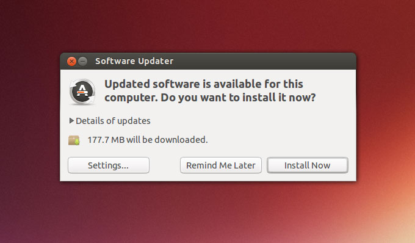

PA0 is a guide to GNU/Linux development environment configuration.
You are guided to install a GNU/Linux development environment.
All PAs and Labs are done in this environment.
 If you are new to GNU/Linux, and you encounter some troubles during the configuration,
which are not mentioned in this lecture note (such as "No such file or directory"), that is your fault.
Go back to read this lecture note carefully.
 Remember, the machine is always right!

<!-- -->
> #### hint::信息框说明
> 讲义中会出现一些信息框, 根据其颜色和左上角的图标可以得知信息的类别.
> 例如本信息框就是一些提示相关的内容. 其它类别主要还有
> > #### flag::实验进度相关的提示
>
<!-- -->
> > #### comment::扩展阅读
>
<!-- -->
> > #### question::选做思考题
>
<!-- -->
> > #### option::选做编程题
>
<!-- -->
> > #### todo::实验必做内容
>
<!-- -->
> > #### danger::实验进度相关的必读信息
>
<!-- -->
> > #### caution::重要性超越实验的原则与方法

<!-- -->
> #### caution::对, 你没有看错, 除了一些重要的信息之外, PA0的实验讲义都是英文!
> 随着科学技术的发展, 在国际学术交流中使用英语已经成为常态:
> 顶尖的论文无一不使用英文来书写, 在国际上公认的计算机领域经典书籍也是使用英文编著.
> 顶尖的论文没有中文翻译版; 如果需要获取信息, 也应该主动去阅读英文材料, 而不是等翻译版出版.
> "我是中国人, 我只看中文"这类观点已经不符合时代发展的潮流,
> 要站在时代的最前沿, 阅读英文材料的能力是不可或缺的.
>
> 阅读英文材料, 无非就是"不会的单词查字典, 不懂的句子反复读".
> 如今网上有各种词霸可解燃眉之急, 但英文阅读能力的提高贵在坚持.
> "刚开始觉得阅读英文效率低", 是所有中国人都无法避免的经历.
> 如果你发现身边的大神可以很轻松地阅读英文材料, 那是因为他们早就克服了这些困难.
> 引用陈道蓄老师的话: 坚持一年, 你就会发现有不同; 坚持两年, 你就会发现大有不同.
>
> 撇开这些高大上的话题不说, 阅读英文材料和你有什么关系呢?
> 有! 因为在PA中陪伴你的, 就是没有中文版的各种手册(例如[riscv手册][riscv]),
> 当然还有`man`: 如果你不愿意阅读英文材料, 你是注定无法独立完成PA的.
>
> 作为过渡, 我们为大家准备了全英文的PA0.
> PA0的目的是配置实验环境, 同时熟悉GNU/Linux下的工作方式.
> 其中涉及的都是一些操作性的步骤, 你不必为了完成PA0而思考深奥的问题.
> 你需要独立完成PA0, 请你认真阅读讲义中的每一个字符, 并按照讲义中的内容进行操作:
> 当讲义提到要在互联网上搜索某个内容时, 你就去互联网上搜索这个内容.
> 如果遇到了错误, 请认真反复阅读讲义内容, <u>机器永远是对的</u>.
> 如果你是第一次使用GNU/Linux, 你还需要查阅大量资料或教程来学习一些新工具的使用方法,
> 这需要花费大量的时间(例如你可能需要花费一个下午的时间, 仅仅是为了使用`vim`在文件中键入两行内容).
> 这就像阅读英文材料一样, 一开始你会觉得效率很低, 但随着时间的推移, 你对这些工具的使用会越来越熟练.
> 相反, 如果你通过"投机取巧"的方式来完成PA0, 你将会马上在PA1中遇到麻烦.
> 正如etone所说, 你在专业上的技不如人, 迟早有一天会找上来.
>
> 另外, PA0的讲义只负责给出操作过程, 并不负责解释这些操作相关的细节和原理.
> 如果你希望了解它们, 请在互联网上搜索相关内容.

[riscv]: https://github.com/riscv/riscv-isa-manual/releases/download/draft-20210813-7d0006e/riscv-spec.pdf

We are going to install the [Ubuntu 22.04][ubuntu] distribution directly over your physical machine.
If you already have one copy of GNU/Linux distribution,
and you want to use your copy as the development environment, just use it!
But if you encounter some troubles because of platform disparity,
please search the Internet for trouble-shooting.

It is also OK to use virtual machines, such as VMWare or VirtualBox.
If you decide to do this and you do not have a copy of GNU/Linux,
please install [Ubuntu][ubuntu] distribution in the virtual machine.
Also, please search the Internet for trouble-shooting if you have any problems about virtual machines.

[ubuntu]: https://ubuntu.com

> #### danger::必须使用带GUI的64位GNU/Linux
> 如果你打算使用已有的GNU/Linux平台, 请确保它是64位版本.
> PA的某些特性会依赖于64位平台和图形显示.

<!-- -->
> #### hint::使用GNU/Linux真机的一些原因
> * 真机的稳定性会比虚拟机相对高一些(比如[crash consistency][crash consistency]之类的).
> * 真机的性能会比虚拟机相对高一些(但不影响实验分数),
>   如果你希望在实验后期获得比较流畅的游戏体验, 真机是一个不错的选择

[crash consistency]: https://en.wikipedia.org/wiki/Data_consistency

<!-- -->
> #### hint::建议体验真机的安装
> 虽然学习计算机专业不是为了修电脑装系统,
> 但如果你连系统都没装过, 也确实不太好意思跟亲戚说你是学计算机的.
> 现在机会来了, 如果你以前真的从来没有安装过操作系统,
> 我们强烈建议你装一下真机, 来了解一下安装操作系统都需要经历些什么.

<!-- -->
> #### hint::Mac用户的不幸
> 与ICS同时开设的数字电路实验课程需要安装`Vivado/Quartus`工具来进行实验,
> 然而非常不幸的是, 这两款工具皆不提供Mac版本.
> 为了使用它们, 你必须安装Windows或者GNU/Linux操作系统.
> 那么, 还不如一石二鸟, 现在装个GNU/Linux真机, 就可以解决上述所有问题了.
>
> 如果你不必修读南京大学的课程, 可以忽略这个问题.

## Preparation

> #### danger::首先当然是备份重要数据!
> 如果你是第一次安装操作系统, 你可能会因为误操作而删除了磁盘上的重要文件.
> 备份数据无疑是一个非常重要的操作, 这样以后你就可以在安装过程中进行各种尝试,
> 随心所欲地折腾你的机器了.
>
> 当然, 就算你安装系统的操作看上去是正确的, 也有可能因为硬件兼容问题导致操作系统无法启动等后果.
> 如果确实发生了这种情况, 就到互联网上搜索解决方案吧.
> 因此, PA0还是要尽早开始体验.

Please reserve at least one partitions (20GB ~ 50GB) on the disk for Ubuntu to install.
If you want to install `Vivado/Quartus` in Ubuntu,
please reserve about 100GB of disk space.
For how to do this, please search the Internet.
For example, if you use Windows, you can search for `压缩卷 Windows`.

## Installing Ubuntu

Please search the Internet for "Ubuntu 22.04 安装教程" and follow the tutorial.

> #### hint::我可以选择其它Ubuntu的版本吗?
> 可以. 不过不同版本的Ubuntu中的工具版本会稍有差异, 尤其是编译器GCC.
> 如果你选择了其它版本, 可能会遇到因此带来的少量问题, 不过这不会对实验内容产生大幅的影响.

<!-- -->
> #### danger::选择语言时选择English, 不要选择中文
> 使用中文的系统环境会给一些命令行操作带来不便, 甚至会增加排查错误的难度.
> 每年都有部分同学因为选择了中文环境, 在工具报错时无法在互联网上搜索到有效的解决方案,
> 从而影响了实验进度.
>
> 事实上, 即使在英文的系统环境中, 也可以通过安装中文输出法来键入中文.

<!-- -->
> #### danger::不要使用Ubuntu的Software Updater
> 在完成安装并初次登陆Ubuntu时, Software Updater会弹出提示框提醒用户更新软件(如下图所示),
> 请务必忽略该提示框, 不要点击"安装".
> 否则安装操作将会改变Ubuntu中包管理器的状态,
> 使其与讲义后续指示的操作产生冲突, 最终将导致系统崩溃而无法再次进入Ubuntu.
>
> 
>
> 建议关闭Software Updater功能使其不再提示, 具体操作请在互联网中搜索解决方案.
> 感谢2020级彭浩伦同学发现此问题.
