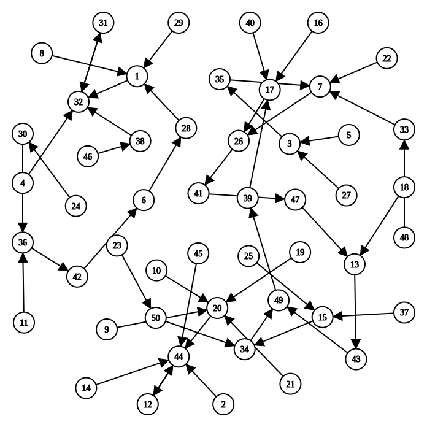

## 开天辟地的篇章

先驱希望创造一个计算机的世界, 并赋予它执行程序的使命.
让我们一起来帮助他, 体验创世的乐趣.

大家都上过程序设计课程, 知道程序就是由代码和数据组成.
例如一个求`1+2+...+100`的程序, 大家不费吹灰之力就可以写出一个程序来完成这件事情.
不难理解, 数据就是程序处理的对象, 代码则描述了程序希望如何处理这些数据.
先不说仙剑奇侠传这个庞然大物, 为了执行哪怕最简单的程序, 最简单的计算机又应该长什么样呢?

### 最简单的计算机

为了执行程序, 首先要解决的第一个问题, 就是要把程序放在哪里.
显然, 我们不希望自己创造的计算机只能执行小程序.
因此, 我们需要一个足够大容量的部件, 来放下各种各样的程序, 这个部件就是存储器.
于是, 先驱创造了存储器, 并把程序放在存储器中, 等待着CPU去执行.

等等, CPU是谁? 你也许很早就听说过它了, 不过现在还是让我们来重新介绍一下它吧.
CPU是先驱最伟大的创造, 从它的中文名字"中央处理器"就看得出它被赋予了至高无上的荣耀:
CPU是负责处理数据的核心电路单元, 也就是说, 程序的执行全靠它了.
但只有存储器的计算机还是不能进行计算.
自然地, CPU需要肩负起计算的重任, 先驱为CPU创造了运算器, 这样就可以对数据进行各种处理了.
如果觉得运算器太复杂, 那就先来考虑一个加法器吧.

先驱发现, 有时候程序需要对同一个数据进行连续的处理.
例如要计算`1+2+...+100`, 就要对部分和`sum`进行累加,
如果每完成一次累加都需要把它写回存储器, 然后又把它从存储器中读出来继续加, 这样就太不方便了.
同时天下也没有免费的午餐, 存储器的大容量也是需要付出相应的代价的,
那就是速度慢, 这是先驱也无法违背的材料特性规律.
于是先驱为CPU创造了寄存器, 可以让CPU把正在处理中的数据暂时存放在其中.

寄存器的速度很快, 但容量却很小, 和存储器的特性正好互补,
它们之间也许会交织出新的故事呢, 不过目前我们还是顺其自然吧.

> #### question::计算机可以没有寄存器吗? (建议二周目思考)
> 如果没有寄存器, 计算机还可以工作吗?
> 如果可以, 这会对硬件提供的编程模型有什么影响呢?
>
> 就算你是二周目来思考这个问题, 你也有可能是第一次听到"编程模型"这个概念.
> 不过如果一周目的时候你已经仔细地阅读过ISA手册, 你会记得确实有这么个概念.
> 所以, 如果想知道什么是编程模型, RTFM吧.

为了让强大的CPU成为忠诚的奴仆, 先驱还设计了"指令", 用来指示CPU对数据进行何种处理.
这样, 我们就可以通过指令来控制CPU, 让它做我们想做的事情了.

有了指令以后, 先驱提出了一个划时代的设想:
能否让程序来自动控制计算机的执行?
为了实现这个设想, 先驱和CPU作了一个简单的约定: 当执行完一条指令之后, 就继续执行下一条指令.
但CPU怎么知道现在执行到哪一条指令呢?
为此, 先驱为CPU创造了一个特殊的计数器, 叫"程序计数器"(Program Counter, PC).
在x86中, 它有一个特殊的名字, 叫`EIP`(Extended Instruction Pointer).

从此以后, 计算机就只需要做一件事情:
```c
while (1) {
  从PC指示的存储器位置取出指令;
  执行指令;
  更新PC;
}
```

这样, 我们就有了一个足够简单的计算机了.
我们只要将一段指令序列放置在存储器中, 然后让PC指向第一条指令,
计算机就会自动执行这一段指令序列, 永不停止.

例如, 下面的指令序列可以计算`1+2+...+100`, 其中`r1`和`r2`是两个寄存器,
还有一个隐含的程序计数器`PC`, 它的初值是`0`.
为了帮助大家理解, 我们把指令的语义翻译成C代码放在右侧, 其中每一行C代码前都添加了一个语句标号:
```
// PC: instruction    | // label: statement
0: mov  r1, 0         |  pc0: r1 = 0;
1: mov  r2, 0         |  pc1: r2 = 0;
2: addi r2, r2, 1     |  pc2: r2 = r2 + 1;
3: add  r1, r1, r2    |  pc3: r1 = r1 + r2;
4: blt  r2, 100, 2    |  pc4: if (r2 < 100) goto pc2;   // branch if less than
5: jmp 5              |  pc5: goto pc5;
```
计算机执行以上的指令序列, 最后会在`PC=5`处的指令陷入死循环,
此时计算已经结束, `1+2+...+100`的结果会存放在寄存器`r1`中.

> #### todo::尝试理解计算机如何计算
> 在看到上述例子之前, 你可能会觉得指令是一个既神秘又难以理解的概念.
> 不过当你看到对应的C代码时, 你就会发现指令做的事情竟然这么简单!
> 而且看上去还有点蠢, 你随手写一个for循环都要比这段C代码看上去更高级.
>
> 不过你也不妨站在计算机的角度来理解一下,
> 计算机究竟是怎么通过这种既简单又笨拙的方式来计算`1+2+...+100`的.
> 这种理解会使你建立"程序如何在计算机上运行"的最初原的认识.

这个全自动的执行过程实在是太美妙了!
事实上, 开拓者图灵在1936年就已经提出[类似的核心思想][trm], "计算机之父"可谓名不虚传.
而这个流传至今的核心思想, 就是"存储程序".
为了表达对图灵的敬仰, 我们也把上面这个最简单的计算机称为"图灵机"(Turing Machine, TRM).
或许你已经听说过"图灵机"这个作为计算模型时的概念,
不过在这里我们只强调作为一个最简单的真实计算机需要满足哪些条件:
* 结构上, TRM有存储器, 有PC, 有寄存器, 有加法器
* 工作方式上, TRM不断地重复以下过程:
从PC指示的存储器位置取出指令, 执行指令, 然后更新PC

[trm]: https://en.wikipedia.org/wiki/Universal_Turing_machine

咦? 存储器, 计数器, 寄存器, 加法器, 这些不都是数字电路课上学习过的部件吗?
也许你会觉得难以置信, 但先驱说, 你正在面对着的那台无所不能的计算机, 就是由数字电路组成的!
不过, 我们在程序设计课上写的程序是C代码.
但如果计算机真的是个只能懂0和1的巨大数字电路, 这个冷冰冰的电路又是如何理解凝结了人类智慧结晶的C代码的呢?
先驱说, 计算机诞生的那些年还没有C语言, 大家都是直接编写对人类来说晦涩难懂的机器指令,
那是他所见过的最早的对电子计算机的编程方式了.
后来人们发明了高级语言和编译器, 能把我们写的高级语言代码进行各种处理, 最后生成功能等价的, CPU能理解的指令.
CPU执行这些指令, 就相当于是执行了我们写的代码.
今天的计算机本质上还是"存储程序"这种天然愚钝的工作方式,
是经过了无数计算机科学家们的努力, 我们今天才可以轻松地使用计算机.

> #### caution::计算机是个状态机
> 既然计算机是一个数组逻辑电路, 那么我们可以把计算机划分成两部分,
> 一部分由所有时序逻辑部件(存储器, 计数器, 寄存器)构成, 另一部分则是剩余的组合逻辑部件(如加法器等).
> 这样以后, 我们就可以从状态机模型的视角来理解计算机的工作过程了:
> 在每个时钟周期到来的时候, 计算机根据当前时序逻辑部件的状态,
> 在组合逻辑部件的作用下, 计算出并转移到下一时钟周期的新状态.
>
> 计算机的这个视角有什么用呢?
> 好像除了让你明白计算机硬件不再那么神秘之外, 也没什么特别的用处.
> 毕竟ICS课不要求大家用硬件描述语言来实现计算机硬件,
> 大家只要相信这件事能做成就可以了.
>
> 不过对于程序来说, 这个视角的作用会超乎你的想象.

### 重新认识程序: 程序是个状态机

如果把计算机看成一个状态机, 那么运行在计算机上面的程序又是什么呢?

我们知道程序是由指令构成的, 那么我们先看看一条指令在状态机的模型里面是什么.
不难理解, 计算机正是通过执行指令的方式来改变自身状态的,
比如执行一条加法指令, 就可以把两个寄存器的值相加, 然后把结果更新到第三个寄存器中;
如果执行一条跳转指令, 就会直接修改PC的值, 使得计算机从新PC的位置开始执行新的指令.
所以在状态机模型里面, 指令可以看成是计算机进行一次状态转移的输入激励.

ICS课本的1.1.3小节中介绍了一个很简单的计算机.
这个计算机有4个8位的寄存器, 一个4位PC, 以及一段16字节的内存(也就是存储器),
那么这个计算机可以表示比特总数为`B = 4*8 + 4 + 16*8 = 164`,
因此这个计算机总共可以有`N = 2^B = 2^164`种不同的状态.
假设这个在这个计算机中, 所有指令的行为都是确定的,
那么给定`N`个状态中的任意一个, 其转移之后的新状态也是唯一确定的.
一般来说`N`非常大, 下图展示了`N=50`时某计算机的状态转移图.



现在我们就可以通过状态机的视角来解释"程序在计算机上运行"的本质了:
给定一个程序, 把它放到计算机的内存中,
就相当于在状态数量为`N`的状态转移图中指定了一个初始状态,
程序运行的过程就是从这个初始状态开始, 每执行完一条指令, 就会进行一次确定的状态转移.
也就是说, 程序也可以看成一个状态机! 这个状态机是上文提到的大状态机(状态数量为`N`)的子集.

例如, 假设某程序在上图所示的计算机中运行,
其初始状态为左上角的8号状态, 那么这个程序对应的状态机为
```
8->1->32->31->32->31->...
```
这个程序可能是:
```
// PC: instruction    | // label: statement
0: addi r1, r2, 2     |  pc0: r1 = r2 + 2;
1: subi r2, r1, 1     |  pc1: r2 = r1 - 1;
2: nop                |  pc2: ;  // no operation
3: jmp 2              |  pc3: goto pc2;
```

> #### todo::从状态机视角理解程序运行
> 以上一小节中`1+2+...+100`的指令序列为例, 尝试画出这个程序的状态机.
>
> 这个程序比较简单, 需要更新的状态只包括`PC`和`r1`, `r2`这两个寄存器,
> 因此我们用一个三元组`(PC, r1, r2)`就可以表示程序的所有状态, 而无需画出内存的具体状态.
> 初始状态是`(0, x, x)`, 此处的`x`表示未初始化.
> 程序`PC=0`处的指令是`mov r1, 0`, 执行完之后`PC`会指向下一条指令, 因此下一个状态是`(1, 0, x)`.
> 如此类推, 我们可以画出执行前3条指令的状态转移过程:
> ```
> (0, x, x) -> (1, 0, x) -> (2, 0, 0) -> (3, 0, 1)
> ```
>
> 请你尝试继续画出这个状态机, 其中程序中的循环只需要画出前两次循环和最后两次循环即可.

通过上面必做题的例子, 你应该更进一步体会到"程序是如何在计算机上运行"了.
我们其实可以从两个互补的视角来看待同一个程序:
* 一个是以代码(或指令序列)为表现形式的静态视角,
大家经常说的"写程序"/"看代码", 其实说的都是这个静态视角. 这个视角的一个好处是描述精简,
分支, 循环和函数调用的组合使得我们可以通过少量代码实现出很复杂的功能.
但这也可能会使得我们对程序行为的理解造成困难.
* 另一个是以状态机的状态转移为运行效果的动态视角, 它直接刻画了"程序在计算机上运行"的本质.
但这一视角的状态数量非常巨大, 程序代码中的所有循环和函数调用都以指令的粒度被完全展开,
使得我们难以掌握程序的整体语义.
但对于程序的局部行为, 尤其是从静态视角来看难以理解的行为,
状态机视角可以让我们清楚地了解相应的细节.

> #### comment::程序的状态机视角有什么好处?
> 有一些程序看上去很简单, 但行为却不那么直观, 比如递归.
> 要很好地理解递归程序在计算机上如何运行, 从状态机视角来看程序行为才是最有效的做法,
> 因为这一视角可以帮助你理清每一条指令究竟如何修改计算机的状态, 从而实现宏观上的递归语义.
> ICS理论课的第三章会专门分析其中的细节, 我们在这里就不展开讨论递归的具体行为了.

<!-- -->
> #### caution::"程序在计算机上运行"的微观视角: 程序是个状态机
> "程序是个状态机"这一视角对ICS和PA来说都是非常重要的,
> 因为"理解程序如何在计算机上运行"就是ICS和PA的根本目标.
> 至于这个问题的宏观视角, 我们将会在PA的中期来介绍.
>
> 这一小节的文字对你来说应该不难理解, 但如果你将来没有养成从状态机视角理解程序行为的意识,
> 你可能会感到PA非常困难, 因为在PA中你需要不断地和代码打交道.
> 如果你不能从微观视角理解某些关键代码的行为, 你也无法从宏观视角完全弄清楚程序究竟是如何运行的.
