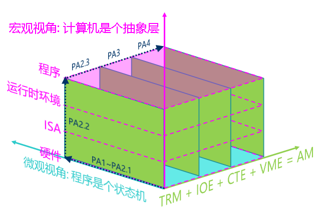

## 程序, 运行时环境与AM

### 运行时环境

为了让NEMU支持大部分程序的运行, 你已经实现了不少指令.
但并不是有了足够的指令就能运行更多的程序.
我们之前提到"并不是每一个程序都可以在NEMU中运行", 现在我们来解释一下背后的缘由.

从直觉上来看, 让仅仅只会"计算"的TRM来支撑一个功能齐全的操作系统的运行还是不太现实的.
这给我们的感觉就是, 计算机也有一定的"功能强弱"之分, 计算机越"强大", 就能跑越复杂的程序.
换句话说, 程序的运行其实是对计算机的功能有需求的.
在你运行Hello World程序时, 你敲入一条命令(或者点击一下鼠标), 程序就成功运行了,
但这背后其实隐藏着操作系统开发者和库函数开发者的无数汗水.
一个事实是, 应用程序的运行都需要[运行时环境][runtime]的支持,
包括加载, 销毁程序, 以及提供程序运行时的各种动态链接库(你经常使用的库函数就是运行时环境提供的)等.
为了让客户程序在NEMU中运行, 现在轮到你来提供相应的运行时环境的支持了.

[runtime]: http://en.wikipedia.org/wiki/Runtime_system

根据KISS法则, 我们先来考虑最简单的运行时环境是什么样的.
换句话说, 为了运行最简单的程序, 我们需要提供什么呢?
其实答案已经在PA1中了: 只要把程序放在正确的内存位置,
然后让PC指向第一条指令, 计算机就会自动执行这个程序, 永不停止.

不过, 虽然计算机可以永不停止地执行指令, 但一般的程序都是会结束的,
所以运行时环境需要向程序提供一种结束运行的方法.
聪明的你已经能想到, 我们在PA1中提到的那条人工添加的`nemu_trap`指令,
就是让程序来结束运行的.

所以, 只要有内存, 有结束运行的方式, 加上实现正确的指令,
就可以支撑最简单程序的运行了.
而这, 也可以算是最简单的运行时环境了.

### 将运行时环境封装成库函数

我们刚才讨论的运行时环境是直接位于计算机硬件之上的,
因此运行时环境的具体实现, 也是和架构相关的.
我们以"ISA-平台"的二元组来表示一个架构, 例如`mips32-nemu`.
以程序结束为例, NEMU中是使用特殊的`nemu_trap`指令,
而不同ISA的`nemu_trap`指令的格式肯定不同;
但如果我们自己用verilog设计了一个riscv32 CPU, 这个`riscv32-mycpu`的架构,
有可能是通过一条`mycpu_trap`指令来结束程序, 它和`nemu_trap`指令可能是不一样的.
而结束运行是程序共有的需求, 为了让`n`个程序运行在`m`个架构上, 难道我们要维护`n*m`份代码?
有没有更好的方法呢?

对于同一个程序, 如果能把`m`个版本不同的部分都转换成相同的代码,
我们就只需要维护一个版本就可以了.
而实现这个目标的杀手锏, 就是你在程序设计课上学过的抽象!
我们只需要定义一个结束程序的API, 比如`void halt()`,
它对不同架构上程序的不同结束方式进行了抽象:
程序只要调用`halt()`就可以结束运行, 而不需要关心自己运行在哪一个架构上.
经过抽象之后, 之前`m`个版本的程序, 现在都统一通过`halt()`来结束运行,
我们就只需要维护这一个通过`halt()`来结束运行的版本就可以了.
然后, 不同的架构分别实现自己的`halt()`, 就可以支撑`n`个程序的运行!
这样以后, 我们就可以把程序和架构解耦了:
我们只需要维护`n+m`份代码(`n`个程序和`m`个架构相关的`halt()`), 而不是之前的`n*m`.

这个例子也展示了运行时环境的一种普遍的存在方式: 库.
通过库, 运行程序所需要的公共要素被抽象成API,
不同的架构只需要实现这些API, 也就相当于实现了支撑程序运行的运行时环境,
这提升了程序开发的效率: 需要的时候只要调用这些API, 就能使用运行时环境提供的相应功能.

> #### question::这又能怎么样呢
> 思考一下, 这样的抽象还会带来哪些好处呢? 你很快就会体会到这些好处了.

### AM - 裸机(bare-metal)运行时环境

一方面, 正如上文提到, 应用程序的运行都需要运行时环境的支持;
另一方面, 只进行纯粹计算任务的程序在TRM上就可以运行,
更复杂的应用程序对运行时环境必定还有其它的需求:
例如你之前玩的超级玛丽需要和用户进行交互, 至少需要运行时环境提供输入输出的支持.
要运行一个现代操作系统, 还要在此基础上加入更高级的功能.

如果我们把这些需求都收集起来, 将它们抽象成统一的API提供给程序,
这样我们就得到了一个可以支撑各种程序运行在各种架构上的库了!
具体地, 每个架构都按照它们的特性实现这组API;
应用程序只需要直接调用这组API即可, 无需关心自己将来运行在哪个架构上.
由于这组统一抽象的API代表了程序运行对计算机的需求, 所以我们把这组API称为抽象计算机.

AM(Abstract machine)项目就是这样诞生的.
作为一个向程序提供运行时环境的库, AM根据程序的需求把库划分成以下模块
```
AM = TRM + IOE + CTE + VME + MPE
```
* TRM(Turing Machine) - 图灵机, 最简单的运行时环境, 为程序提供基本的计算能力
* IOE(I/O Extension) - 输入输出扩展, 为程序提供输出输入的能力
* CTE(Context Extension) - 上下文扩展, 为程序提供上下文管理的能力
* VME(Virtual Memory Extension) - 虚存扩展, 为程序提供虚存管理的能力
* MPE(Multi-Processor Extension) - 多处理器扩展, 为程序提供多处理器通信的能力
(MPE超出了ICS课程的范围, 在PA中不会涉及)

AM给我们展示了程序与计算机的关系:
利用计算机硬件的功能实现AM, 为程序的运行提供它们所需要的运行时环境.
感谢AM项目的诞生, 让NEMU和程序的界线更加泾渭分明, 同时使得PA的流程更加明确:
```
(在NEMU中)实现硬件功能 -> (在AM中)提供运行时环境 -> (在APP层)运行程序
(在NEMU中)实现更强大的硬件功能 -> (在AM中)提供更丰富的运行时环境 -> (在APP层)运行更复杂的程序
```
这个流程其实与PA1中开天辟地的故事遥相呼应:
先驱希望创造一个计算机的世界, 并赋予它执行程序的使命.
亲自搭建NEMU(硬件)和AM(软件)之间的桥梁来支撑程序的运行,
是"理解程序如何在计算机上运行"这一终极目标的不二选择.

> #### caution::AM的诞生和Project-N的故事
> 在AM诞生之前, Project-N的各个主要部件就已经存在了:
> * NEMU - NJU EMUlator (系统基础实验)
> * Nanos - Nanjing U OS (操作系统实验)
> * NOOP - NJU Out-of-Order Processor (组成原理实验)
> * NCC - NJU C Compiler (编译原理实验)
>
> 但我们一直没想好, 如何把这些部件集成到一个完整的教学生态系统中.
>
> 在2017年春季的计算机系统综合实验课程中, [jyy][jyy]首先提出AM的思想, 把程序和架构解耦.
> 解耦之后, AM就成了Project-N的一把关键的钥匙:
> 只要实现了AM, 我们就可以在NEMU和NOOP上运行各种AM程序;
> 只要在AM上实现Nanos, 我们就可以把Nanos运行在NEMU和NOOP上;
> 只要NCC把程序编译到AM上, 我们就可以在NOOP上运行NCC编译的程序.
>
> 经过几个月的尝试, 我们很快就相信, 这条路是对的.
> 于是临时决定将2017年秋季的PA进行大改版, 借鉴AM的思想来设计开发NEMU,
> 期望大家能更好地理解"程序如何在计算机上运行".
> 因此2017年秋季版本的NEMU, 也算是第一次正式作为一个子项目收录到Project-N教学生态系统中.
>
> 我们已经连续两年组队参加计算机系统设计大赛"龙芯杯",
> 在大赛上展示我们独有的Project-N生态系统, 均获得第二名的好成绩.
> 我们在大赛中探索出来的好方法, 也会反馈到PA中.
> 这些离你其实并不遥远, 我们在PA中传递出来的做事方法和原则, 都是大赛得奖的黄金经验.
>
> 如果你对AM和Project-N感兴趣, 欢迎联系jyy或yzh.

[jyy]: http://moon.nju.edu.cn/~jyy/

> #### hint::穿越时空的羁绊
> 有了AM, 我们就可以把课程之间的实验打通, 做一些以前做不到的有趣的事情了.
> 比如今年春季的操作系统课上, 你的学长学姐在AM上编写了他们自己的小游戏.
> 在今年PA的后期, 你将有机会把学长学姐们编写的游戏无缝地移植到NEMU上,
> 作为最终系统展示的一部分, 想想都是一件激动人心的事情.

<!-- -->
> #### question::为什么要有AM? (建议二周目思考)
> 操作系统也有自己的运行时环境.
> AM和操作系统提供的运行时环境有什么不同呢? 为什么会有这些不同?

### RTFSC(3)

你已经在PA0的最后获得了AM的子项目`abstract-machine`, 下面我们来简单介绍一下AM项目的代码.
代码中`abstract-machine/`目录下的源文件组织如下(部分目录下的文件并未列出):
```
abstract-machine
├── am                                  # AM相关
│   ├── include
│   │   ├── amdev.h
│   │   ├── am.h
│   │   └── arch                        # 架构相关的头文件定义
│   ├── Makefile
│   └── src
│       ├── mips
│       │   ├── mips32.h
│       │   └── nemu                    # mips32-nemu相关的实现
│       ├── native
│       ├── platform
│       │   └── nemu                    # 以NEMU为平台的AM实现
│       │       ├── include
│       │       │   └── nemu.h
│       │       ├── ioe                 # IOE
│       │       │   ├── audio.c
│       │       │   ├── disk.c
│       │       │   ├── gpu.c
│       │       │   ├── input.c
│       │       │   ├── ioe.c
│       │       │   └── timer.c
│       │       ├── mpe.c               # MPE, 当前为空
│       │       └── trm.c               # TRM
│       ├── riscv
│       │   ├── nemu                    # riscv32(64)相关的实现
│       │   │   ├── cte.c               # CTE
│       │   │   ├── start.S             # 程序入口
│       │   │   ├── trap.S
│       │   │   └── vme.c               # VME
│       │   └── riscv.h
│       └── x86
│           ├── nemu                    # x86-nemu相关的实现
│           └── x86.h
├── klib                                # 常用函数库
├── Makefile                            # 公用的Makefile规则
└── scripts                             # 构建/运行二进制文件/镜像的Makefile
    ├── isa
    │   ├── mips32.mk
    │   ├── riscv32.mk
    │   ├── riscv64.mk
    │   └── x86.mk
    ├── linker.ld                       # 链接脚本
    ├── mips32-nemu.mk
    ├── native.mk
    ├── platform
    │   └── nemu.mk
    ├── riscv32-nemu.mk
    ├── riscv64-nemu.mk
    └── x86-nemu.mk
```

整个AM项目分为两大部分:
* `abstract-machine/am/` - 不同架构的AM API实现, 目前我们只需要关注NEMU相关的内容即可.
此外, `abstract-machine/am/include/am.h`列出了AM中的所有API, 我们会在后续逐一介绍它们.
* `abstract-machine/klib/` - 一些架构无关的库函数, 方便应用程序的开发

阅读`abstract-machine/am/src/platform/nemu/trm.c`中的代码,
你会发现只需要实现很少的API就可以支撑起程序在TRM上运行了:
* `Area heap`结构用于指示堆区的起始和末尾
* `void putch(char ch)`用于输出一个字符
* `void halt(int code)`用于结束程序的运行
* `void _trm_init()`用于进行TRM相关的初始化工作

堆区是给程序自由使用的一段内存区间, 为程序提供动态分配内存的功能.
TRM的API只提供堆区的起始和末尾, 而堆区的分配和管理需要程序自行维护.
当然, 程序也可以不使用堆区, 例如`dummy`.
把`putch()`作为TRM的API是一个很有趣的考虑, 我们在不久的将来再讨论它,
目前我们暂不打算运行需要调用`putch()`的程序.

最后来看看`halt()`. `halt()`里面调用了`nemu_trap()`宏
(在`abstract-machine/am/src/platform/nemu/include/nemu.h`中定义),
这个宏展开之后是一条[内联汇编][inline asm]语句.
内联汇编语句允许我们在C代码中嵌入汇编语句,
以riscv32为例, 宏展开之后将会得到:
```c
asm volatile("mv a0, %0; ebreak" : :"r"(code));
```
显然, 这个宏的定义是和ISA相关的, 如果你查看`nemu/src/isa/$ISA/inst.c`,
你会发现这条指令正是那条特殊的`nemu_trap`!
`nemu_trap()`宏还会把一个标识结束的结束码移动到通用寄存器中,
这样, 这段汇编代码的功能就和`nemu/src/isa/$ISA/inst.c`中`nemu_trap`的行为对应起来了:
通用寄存器中的值将会作为参数传给`set_nemu_state()`,
将`halt()`中的结束码设置到NEMU的monitor中, monitor将会根据结束码来报告程序结束的原因.
此外, `volatile`是C语言的一个关键字, 如果你想了解关于`volatile`的更多信息, 请查阅相关资料.

[inline asm]: http://www.ibiblio.org/gferg/ldp/GCC-Inline-Assembly-HOWTO.html

`am-kernels`子项目用于收录一些可以在AM上运行的测试集和简单程序:
```
am-kernels
├── benchmarks                  # 可用于衡量性能的基准测试程序
│   ├── coremark
│   ├── dhrystone
│   └── microbench
├── kernels                     # 可展示的应用程序
│   ├── hello
│   ├── litenes                 # 简单的NES模拟器
│   ├── nemu                    # NEMU
│   ├── slider                  # 简易图片浏览器
│   ├── thread-os               # 内核线程操作系统
│   └── typing-game             # 打字小游戏
└── tests                       # 一些具有针对性的测试集
    ├── am-tests                # 针对AM API实现的测试集
    └── cpu-tests               # 针对CPU指令实现的测试集
```

在让NEMU运行客户程序之前, 我们需要将客户程序的代码编译成可执行文件.
需要说明的是, 我们不能使用gcc的默认选项直接编译,
因为默认选项会根据GNU/Linux的运行时环境将代码编译成运行在GNU/Linux下的可执行文件.
但此时的NEMU并不能为客户程序提供GNU/Linux的运行时环境, 在NEMU中无法正确运行上述可执行文件,
因此我们不能使用gcc的默认选项来编译用户程序.

解决这个问题的方法是[交叉编译][cross compile].
我们需要在GNU/Linux下根据AM的运行时环境编译出能够在`$ISA-nemu`这个新环境中运行的可执行文件.
为了不让链接器ld使用默认的方式链接, 我们还需要提供描述`$ISA-nemu`的运行时环境的链接脚本.
AM的框架代码已经把相应的配置准备好了, 上述编译和链接选项主要位于`abstract-machine/Makefile`
以及`abstract-machine/scripts/`目录下的相关`.mk`文件中.
编译生成一个可以在NEMU的运行时环境上运行的程序的过程大致如下:
* gcc将`$ISA-nemu`的AM实现源文件编译成目标文件,
  然后通过ar将这些目标文件作为一个库, 打包成一个归档文件`abstract-machine/am/build/am-$ISA-nemu.a`
* gcc把应用程序源文件(如`am-kernels/tests/cpu-tests/tests/dummy.c`)编译成目标文件
* 通过gcc和ar把程序依赖的运行库(如`abstract-machine/klib/`)也编译并打包成归档文件
* 根据Makefile文件`abstract-machine/scripts/$ISA-nemu.mk`中的指示,
  让ld根据链接脚本`abstract-machine/scripts/linker.ld`,
  将上述目标文件和归档文件链接成可执行文件

[cross compile]: http://en.wikipedia.org/wiki/Cross_compiler

根据上述链接脚本的指示, 可执行程序重定位后的节从`0x100000`或`0x80000000`开始
(取决于`_pmem_start`和`_entry_offset`的值), 首先是`.text`节,
其中又以`abstract-machine/am/src/$ISA/nemu/start.S`中自定义的`entry`节开始,
然后接下来是其它目标文件的`.text`节. 这样, 可执行程序起始处总是放置`start.S`的代码,
而不是其它代码, 保证客户程序总能从`start.S`开始正确执行.
链接脚本也定义了其它节(包括`.rodata`, `.data`, `.bss`)的链接顺序,
还定义了一些关于位置信息的符号, 包括每个节的末尾, 栈顶位置, 堆区的起始和末尾.

我们对编译得到的可执行文件的行为进行简单的梳理:
1. 第一条指令从`abstract-machine/am/src/$ISA/nemu/start.S`开始,
设置好栈顶之后就跳转到`abstract-machine/am/src/platform/nemu/trm.c`的`_trm_init()`函数处执行.
1. 在`_trm_init()`中调用`main()`函数执行程序的主体功能,
`main()`函数还带一个参数, 目前我们暂时不会用到, 后面我们再介绍它.
1. 从`main()`函数返回后, 调用`halt()`结束运行.

有了TRM这个简单的运行时环境, 我们就可以很容易地在上面运行各种"简单"的程序了.
当然, 我们也可以运行"不简单"的程序:
我们可以实现任意复杂的算法, 甚至是各种理论上可计算的问题, 都可以在TRM上解决.

> #### todo::阅读Makefile
> `abstract-machine`项目的Makefile设计得非常巧妙,
> 你需要把它们看成一种代码来RTFSC, 从而理解它们是如何工作的.
> 这样一来, 你就知道怎么编写有一定质量的Makefile了;
> 同时, 如果哪天Makefile出现了非预期的行为, 你就可以尝试对Makefile进行调试了.
> 当然, 这少不了[RTFM][make].

[make]: http://www.gnu.org/software/make/manual/make.pdf

> #### todo::通过批处理模式运行NEMU
> 我们知道, 大部分同学很可能会这么想:
> 反正我不阅读Makefile, 老师助教也不知道, 总觉得不看也无所谓.
>
> 所以在这里我们加一道必做题:
> 我们之前启动NEMU的时候, 每次都需要手动键入`c`才能运行客户程序.
> 但如果不是为了使用NEMU中的sdb, 我们其实可以节省`c`的键入.
> NEMU中实现了一个批处理模式, 可以在启动NEMU之后直接运行客户程序.
> 请你阅读NEMU的代码并合适地修改Makefile, 使得通过AM的Makefile可以默认启动批处理模式的NEMU.
>
> 你现在仍然可以跳过这道必做题, 但很快你就会感到不那么方便了.

### 实现常用的库函数

我们已经在TRM上运行了不少简单的程序了,
但如果想在TRM上编写一些稍微复杂的程序, 我们就会发现有点不方便.
目前TRM这个最简单的运行时环境只提供了堆区和`halt()`,
但我们平时经常使用的像`memcpy()`这样的库函数却没有提供.
既然没有提供, 那就让我们来实现一下吧.

既然叫得起库函数, 那说明很多程序都可以用到它们,
所以我们可以像AM那样, 把它们组织成一个库.
然而和AM不同的是, 这些库函数的具体实现可以是和架构无关的:
与`halt()`不同, 在NEMU上, 或者在你将来用verilog实现的CPU上,
甚至是其它的架构, `memcpy()`都可以通过相同的方式来实现.
所以, 如果在AM中来实现这些常用的库函数, 就会引入不必要的重复代码.

一种好的做法是把运行时环境分成两部分:
一部分是架构相关的运行时环境, 也就是我们之前介绍的AM;
另一部分是架构无关的运行时环境, 类似`memcpy()`这种常用的函数应该归入这部分,
`abstract-machine/klib/`用于收录这些架构无关的库函数.
`klib`是`kernel library`的意思, 用于提供一些兼容libc的基础功能.
框架代码在`abstract-machine/klib/src/string.c`和`abstract-machine/klib/src/stdio.c`
中列出了将来可能会用到的库函数, 但并没有提供相应的实现.

> #### todo::实现字符串处理函数
> 根据需要实现`abstract-machine/klib/src/string.c`中列出的字符串处理函数,
> 让`cpu-tests`中的测试用例`string`可以成功运行.
> 关于这些库函数的具体行为, 请务必RTFM.

<!-- -->
> #### caution::计算机系统中的约定与未定义行为
> 无处不在的手册其实折射出计算机系统工作的一种基本原则: 遵守约定.
>
> 违反约定会发生什么呢? 最常见的就是程序无法得到正确的结果.
> 例如你实现的`strcpy()`没有拷贝末尾的`\0`, 违反了手册的约定,
> 按照C语言标准的约定, 调用这个错误的`strcpy()`很可能会得到一个超长的目标字符串.
> 当然也有可能目标字符串附近正好是一片'\0', 撞大运地得到正确的运行结果.
> 总之, 违反约定的具体行为会怎么样, 还需要具体问题具体分析, 很难明确地说清楚.
>
> 既然说不清楚, 那就干脆不说吧, 于是有了[未定义行为(UB, Undefined Behavior)][ub]的概念:
> 只要遵守约定, 就能保证程序具有遵守约定后的特性;
> 如果违反, 不按照说好的来, 那就不保证行为是正确的.
>
> 计算机系统就是这样工作的: 计算机系统抽象层之间的接口其实也是一种约定,
> 比如指令就是软件和硬件的一种接口, 所以有了ISA手册来规范每一条指令的行为.
> * 一方面, 编译器需要根据ISA手册中的约定来生成可以正确执行的代码.
> 如果编译器不按照手册约定来生成代码, 那么编译出的程序的行为就是未定义的.
> * 另一方面, 硬件开发者也需要根据ISA手册中的约定来设计可以正确执行指令的处理器.
> 如果处理器不按照手册约定来执行指令, 处理器运行程序的行为就是未定义的.
>
> 引入未定义行为还有一个好处是, 给约定的实现方式带来一定的自由度.
> 例如, C语言标准规定, 整数除法的除数为0时, 结果是未定义的.
> x86的除法指令在检测到除数为0时, 就会向CPU抛出一个异常信号.
> 而MIPS的除法指令则更简单暴力: 首先在MIPS指令集手册中声明, 除数为0时, 结果未定义;
> 然后在硬件上实现除法器电路的时候, 对除0操作就可以视而不见了.
> 然而给定一个除法器电路, 就算除数为0, 电路的输出也总会有一个值,
> 至于具体的值是什么, 就看造化了. 反正C语言标准规定除0的行为本身就是未定义的,
> 让除法指令随便返回一个值, 也不算违反C语言标准的约定.
>
> 未定义行为其实就在你身边. 比如野指针的解引用, 会发生什么完全无法预料.
> 还有你经常使用的`memcpy()`, 如果源区间和目的区间有重叠时, 它的行为会怎么样?
> 如果你从来没有思考过这个问题, 你应该去`man`一下, 然后思考一下为什么会这样.
> 还有一种有人欢喜有人愁的现象是基于未定义行为的编译优化:
> 既然源代码的行为是未定义的, 编译器基于此进行各种奇葩优化当然也不算违反约定.
> [这篇文章][apsys]列举了一些让你大开眼界的花式编译优化例子,
> 看完之后你就会刷新对程序行为的理解了.
>
> <font color=red>所以这就是为什么我们强调要学会RTFM.</font>
> RTFM是了解接口行为和约定的过程: 每个输入的含义是什么? 查阅对象的具体行为是什么?
> 输出什么? 有哪些约束条件必须遵守? 哪些情况下会报什么错误? 哪些行为是UB?
> 只有完全理解并遵守它们, 才能正确无误地使用查阅的对象,
> 大至系统设计原则, 小到一个`memcpy()`的行为, 都蕴含着约定与遵守的法则.
> 理解这些法则, 也是理解计算机系统的不二途径.

[ub]: https://en.wikipedia.org/wiki/Undefined_behavior
[apsys]: https://homes.cs.washington.edu/~akcheung/papers/apsys12.pdf

> #### comment::UB, 编译优化和datalab
> 听闻大班的lab1(datalab)曾经因为使用了debian10的新版gcc而翻车.
> 后来了解到, 是因为datalab的参考代码中含有int整数溢出的UB,
> debian 10的gcc利用了该UB进行编译优化, 导致参考代码生成了错误的参考答案.
>
> C语言标准规定, int整数溢出的行为是未定义的, 但大部分程序员并不知道这一约定,
> 甚至连市面上流行的C语言教科书都认为int整数溢出的结果是wrap around.
> datalab是CMU设计的实验, 但原作者也会编写出含有UB的代码,
> 说明原作者对UB的理解也并未到位. 在旧版本的编译器中, 这些UB均未被触发.
> 但UB毕竟是UB, 只能说明作者写代码的时候没有充分理解C语言标准.
>
> [这篇论文][integer overflow]对整数溢出的分类和行为进行了梳理,
> 并且在实际应用中找出了大量整数溢出的例子进行分析, 推荐大家阅读.
> 论文中提到有一个被广泛应用(包括Office和Windows)的函数库SafeInt用于避免整数溢出,
> 但这个函数库自身的代码就被论文作者检测出整数溢出导致的UB,
> 可谓是`SafeInt is not safe`.
>
> 这些例子给我们的启示是: <font color=red>我们不仅需要编写通过测试的代码,
> 而且需要编写符合语言规范的well-defined的代码</font>.
> 退一步讲, 人都会犯错误, 但我们至少要在出错的时候知道, 什么才是对的.

[integer overflow]: http://www.cs.utah.edu/~regehr/papers/overflow12.pdf

为了运行测试用例`hello-str`, 你还需要实现库函数`sprintf()`.
和其它库函数相比, `sprintf()`比较特殊, 因为它的参数数目是可变的.
为了获得数目可变的参数, 你可以使用C库`stdarg.h`中提供的宏, 具体用法请查阅`man stdarg`.

> #### todo::实现sprintf
> 实现`abstract-machine/klib/src/stdio.c`中的`sprintf()`,
> 具体行为可以参考`man 3 printf`.
> 目前你只需要实现`%s`和`%d`就能通过`hello-str`的测试了,
> 其它功能(包括位宽, 精度等)可以在将来需要的时候再自行实现.

<!-- -->
> #### question::stdarg是如何实现的?
> `stdarg.h`中包含一些获取函数调用参数的宏, 它们可以看做是调用约定中关于参数传递方式的抽象.
> 不同ISA的ABI规范会定义不同的函数参数传递方式, 如果让你来实现这些宏, 你会如何实现?

### 重新认识计算机: 计算机是个抽象层

我们在PA1中介绍了"程序在计算机上运行"的微观视角: 程序是个状态机.
状态机视角可以从指令层次精确地描述程序运行的每一处细节, 但这丢失了程序的语义.
对于一些简单的程序, 你还可以把状态机画出来, 但面对一些复杂的程序, 状态机视角就不能帮助我们了.
为了更好地理解复杂程序, 我们需要从一个新的视角来切入.

我们先来讨论在TRM上运行的程序, 我们对这些程序的需求进行分类,
来看看我们的计算机系统是如何支撑这些需求的.

|    TRM   |     计算   |     内存申请     |    结束运行   |       打印信息      |
|:--------:|:----------:|:----------------:|:-------------:|:-------------------:|
| 运行环境 |     -      |  malloc()/free() |       -       |       printf()      |
|  AM API  |     -      |       heap       |     halt()    |       putch()       |
|  ISA接口 |    指令    | 物理内存地址空间 | nemu_trap指令 |       I/O方式       |
| 硬件模块 |   处理器   |     物理内存     |    Monitor    |         串口        |
| 电路实现 | cpu_exec() |      pmem[]      |   nemu_state  | serial_io_handler() |

* 计算. 这是程序最基本的需求, 以至于它甚至不属于运行时环境和AM的范畴.
  所有计算相关的代码(顺序语句, 分支, 循环, 函数调用等),
  都会被编译器编译成功能等价的指令序列, 最终在CPU上执行.
  在NEMU中, 我们通过`cpu_exec()`函数来实现"CPU执行指令"的功能.
* 内存申请. 有的程序需要在运行时刻动态地申请内存来使用.
  和libc类似, klib提供了`malloc()`和`free()`来实现内存的动态管理(你将来会实现它们),
  它们又会使用TRM中提供的API `heap`来获得堆区的起始和末尾.
  而`heap`的区间又是由ISA-平台这个二元组对应的物理内存地址空间来决定的.
  这一地址空间对应着物理内存的大小, 在NEMU中, 它就是大数组`pmem[]`的大小.
* 结束运行. 一般程序都会有结束运行的时候, TRM提供了一个`halt()`的API来实现这一功能.
  由于这个需求过于简单, 因此无需运行时环境提供更复杂的接口.
  `halt()`的具体实现和ISA有关, 我们使用了人为添加的`nemu_trap`指令来实现这一点.
  执行`nemu_trap`指令会让NEMU从CPU执行指令的循环中跳出, 返回到Monitor中,
  这是通过设置Monitor中的一个状态变量`nemu_state`来实现的.
* 打印信息. 输出是程序的另一个基本需求.
  程序可以调用klib中的`printf()`来输出, 它会通过TRM的API `putch()`来输出字符.
  不同的ISA-平台有不同的字符输出方式, 在$ISA-nemu中, `putch()`通过I/O相关的指令把字符写入到串口,
  最终在NEMU中通过`serial_io_handler()`将字符打印到终端.
  关于输入输出的更多细节会在PA2的最后部分进行介绍.

> #### caution::"程序在计算机上运行"的宏观视角: 计算机是个抽象层
> 在之前的PA中, 我们一直都在强调"程序是个状态机"这个微观视角,
> 让大家站在底层来理解这个状态机是如何工作的.
> 现在我们终于有机会向高层远眺, 来理解计算机是如何把底层的功能经过层层抽象, 最终支撑程序的运行.
>
> 每一层抽象都有它存在的理由:
> * 概念相同的一个硬件模块有着不同的实现方式, 比如处理器既可以通过NEMU中简单的解释方式来实现,
>   也可以通过类似QEMU中高性能的二进制翻译方式来实现,
>   甚至可以通过verilog等硬件描述语言来实现一个真实的处理器.
> * ISA是硬件向软件提供的可以操作硬件的接口
> * AM的API对不同ISA(如x86/mips32/riscv32)的接口进行了抽象, 为上层的程序屏蔽ISA相关的细节
> * 运行时环境可以通过对AM的API进行进一步的封装, 向程序提供更方便的功能
>
> 这些抽象都是为了方便我们在各种各样的计算机系统中编写运行五花八门的程序,
> 你将要在PA3中运行的仙剑奇侠传, 也都是通过层层抽象分解成最基本的硬件操作, 最后以状态机的方式来运行.

<!-- -->
> #### flag::PA究竟在做什么?
> 到此为止, 我们已经将PA中最重要的两个关于"程序在计算机上运行"的视角介绍完了:
> * 微观视角: 程序是个状态机
> * 宏观视角: 计算机是个抽象层
>
> PA剩下的内容就是借鉴AM的启发, 按照计算机发展史的顺序给计算机硬件添加各种新特性,
> 并强化运行时环境的功能, 最后运行各种更复杂的程序.
> PA会把添加新特性的过程作为案例, 让大家不断地从这两个视角来理解"程序如何在计算机上运行".
> 具体地, 在PA2的最后, 我们会添加IOE来实现一个冯诺依曼计算机系统;
> 在PA3中, 我们会添加CTE, 来支持批处理系统的运行;
> 在最后的PA4中, 我们会添加VME, 来运行一个简单又酷炫的分时多任务系统.
>
> 我们在这里给出PA的一个全局概念图(图中的"运行时环境"包含了AM, klib, 甚至是OS和libc),
> 这个图的三维坐标轴总结了PA中3个最重要的结论, 也向大家展示了PA构建计算机系统的全过程.
> 大家在做实验的时候也可以多多思考: 我现在写的代码究竟位于哪一个抽象层?
> 代码的具体行为究竟是什么?
> 
