## SoC计算机系统

> #### info::视频录播和课件
> * 录播 - [SoC计算机系统](https://www.bilibili.com/video/BV1ZK41117MB/)
> * 课件 - [SoC计算机系统](https://ysyx.oscc.cc/slides/2205/18.html#/)

System on a Chip (SoC)，即系统级芯片或片上系统。

我们在之前的讲义中已经了解了总线的概念，也已经尝试了编写和验证自己的总线。
尽管我们已经做了许多工作，但都还处于处理器核的范畴内，并没有涉及计算机系统的概念。
从集成电路的角度入手，SoC是把整个系统集成在单个（或几个）芯片上，从而完成复杂系统功能的集成电路。

> #### question::什么是计算机系统？
> 经过这么长时间的一生一芯学习，你是否对于计算机系统有了进一步的理解呢？
> 
> 我们可以把计算机系统分成应用程序、操作系统、硬件系统、晶体管四个大的层次。
> 应用程序与操作系统之间的界面是应用程序编程接口API (Application Programming Interface)和应用程序二进制接口ABI(Application Binary Interface)；
> 操作系统和硬件系统之间的界面是指令系统ISA (Instruction Set Architecture);
> 硬件系统和晶体管之间的界面是工艺模型。
> 
> 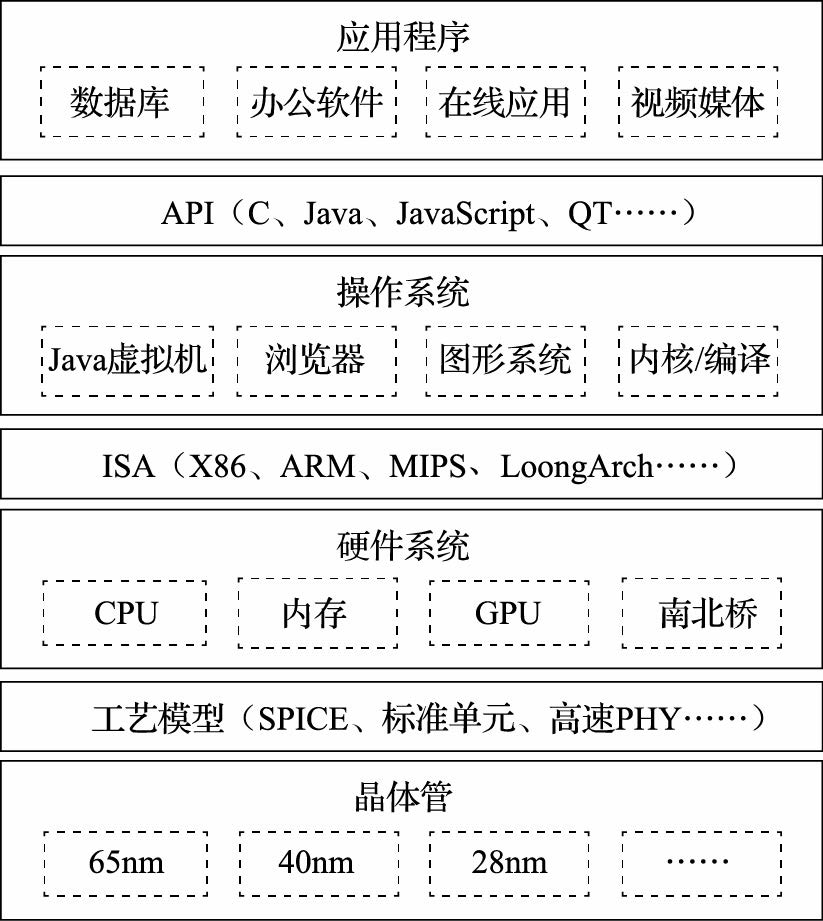

> #### todo::了解API和ABI的区别

## 计算机系统硬件结构的发展
刚刚我们已经介绍过SoC的基本概念，但似乎依然缺乏对于SoC和CPU的直观理解。
我们可以尝试从冯·诺依曼结构入手，进一步展开SoC的细节。

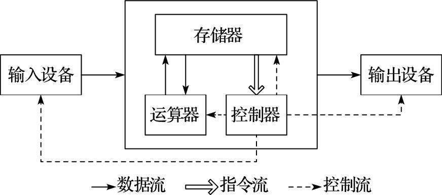

简要来说，计算机由存储器、运算器、控制器、输入设备和输出设备五部分组成，
其中运算器和控制器合称为中央处理器 (Central Processing Processor)，也就是CPU。
冯·诺依曼结构以运算器为中心，输入输出设备与存储器之间的数据传送都需要经过运算器。
当然，随着技术的进步，冯·诺依曼结构也得到了持续改进，由以运算器为中心改进为以存储器为中心。

随着应用需求的变化和工艺水平的不断提升，冯·诺依曼结构中的控制器和运算器逐渐演变为计算机系统中的中央处理器部分；
输入、输出设备统一通过北桥和南桥与中央处理器连接；
中央处理器中的图形处理功能由中央处理器中分化出来，形成专用的图形处理器。
因此，现代计算机系统的硬件结构主要包括了中央处理器、图形处理器、北桥及南桥等部分。

* 中央处理器：主要包含控制器和运算器，传统的中央处理器在SoC中更多地体现为处理器核。
* 图形处理器：面向2D和3D图形、视频、可视化计算和显示优化的处理器。
* 北桥：离CPU最近的芯片，主要负责控制显卡、内存与CPU之间的数据交换。向上连接处理器，向下连接南桥。
* 南桥：主要负责硬盘、键盘以及各种对带宽要求较低的IO接口与内存、CPU之间的数据交换。

### CPU‑GPU‑北桥‑南桥四片结构
现代计算机的一种早期结构是CPU‑GPU‑北桥‑南桥结构。
在该结构中，计算机系统包含四个主要芯片，其中CPU芯片、北桥芯片和南桥芯片一般是直接以芯片的形式安装或焊接在计算机主板上，而GPU则以显卡的形式安装在计算机主板的插槽上。

计算机的各个部件根据速度快慢以及与处理器交换数据的频繁程度被安排在北桥和南桥中，CPU通过处理器总线和北桥直接相连，北桥再通过南北桥总线和南桥相连。
GPU一般以显卡的形式连接北桥，内存控制器集成在北桥芯片中；硬盘接口、音频接口以及鼠标、键盘等接口放在南桥芯片中。

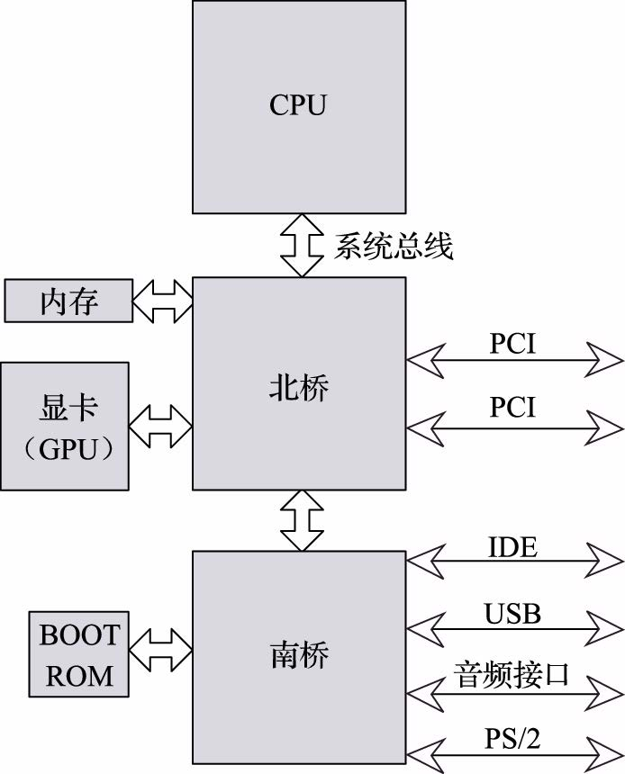

### CPU‑北桥‑南桥三片结构
现代计算机的一种典型结构是CPU‑北桥‑南桥结构。
在该结构中，系统包含三个主要芯片，分别为CPU芯片、北桥芯片和南桥芯片。
三片结构与四片结构最大的区别是，前者GPU功能被集成到北桥中，即一般所说的集成显卡。

和四片结构类似，CPU通过处理器总线和北桥直接相连，北桥再通过南北桥总线和南桥相连。
内存控制器、显示功能以及高速IO接口（如PCIE等）集成在北桥芯片中；硬盘接口、音频接口以及鼠标、键盘等接口仍旧放在南桥芯片中。
随着计算机技术的发展，更多的高速接口被引入计算机体系结构中，在北桥上集成的IO接口的速率也不断提升。

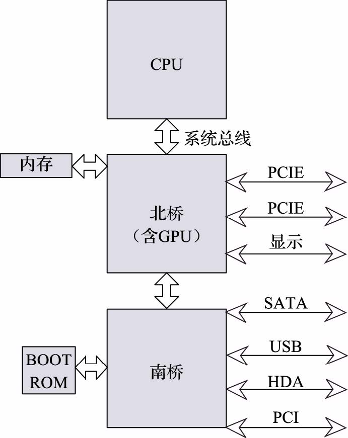

### CPU‑弱北桥‑南桥三片结构
随着芯片的集成度不断提高，单一芯片中能够实现的功能越来越复杂。
内存接口的带宽需求超过了处理器与北桥之间连接的处理器总线接口，导致内存的实际访问性能受限于处理器总线的性能。
伴随着处理器核计算性能的大幅提升，存储器的性能提升却显得幅度较小，这两者的差异导致计算机系统性能受到存储器系统发展的制约，也就是所谓存储墙问题。

因此，对计算机系统性能影响显著的内存控制器开始被集成到CPU芯片中，从而大幅降低了内存访问延迟，提升了内存访问带宽。
于是，北桥的功能被弱化，主要集成了GPU、显示接口、高速IO接口（如PCIE等）。

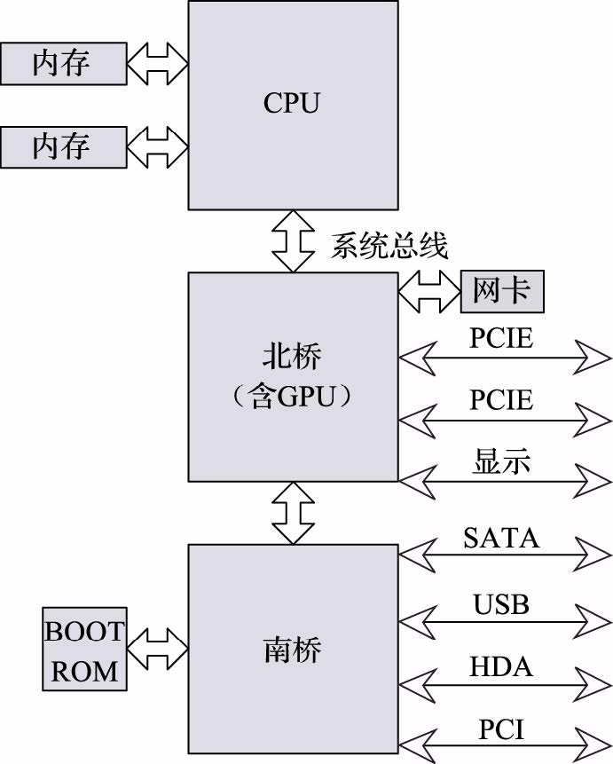

### CPU‑南桥两片结构
随着芯片集成度的进一步提高，图形处理器也开始被集成到CPU芯片中。
因此，北桥存在的必要性就进一步降低，开始和南桥合二为一，形成CPU‑南桥结构。

在该结构中，CPU芯片集成处理器核、内存控制器和GPU等主要部件，对外提供显示接口、内存接口等，并通过处理器总线和南桥相连；
南桥芯片则包含硬盘、USB、网络控制器以及PCIE/PCI、LPC等总线接口。
当然，也有一些两片结构是将GPU集成在南桥芯片中，这样在南桥上可以实现独立的显存供GPU使用，某些条件下更有利于GPU性能的发挥。

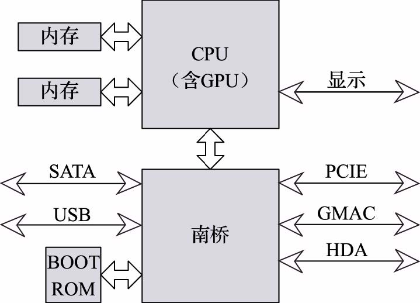

### SoC单片结构

SoC是一种单片计算机系统解决方案，在单个芯片上集成了处理器、内存控制器、GPU以及硬盘、USB、网络等IO接口，用户在搭建计算机系统时只需要使用单个主要芯片即可。
目前SoC主要应用于移动处理器和工业控制领域，相比于多片结构，单片SoC的集成度更高，功耗控制方法更加灵活，有利于系统的小型化和低功耗设计。
不过，由于全系统都在一个芯片上实现，系统的扩展性没有多片结构好，升级的开销也更大。

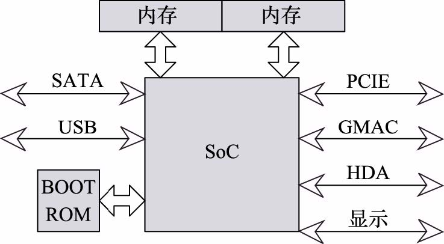

目前，主流商用处理器中，面向中高端领域的处理器普遍采用两片结构，而面向中低端及嵌入式领域的处理器普遍采用单片结构。
SoC单片结构最常见的是在手机等移动设备中，例如Apple M1 Chip。

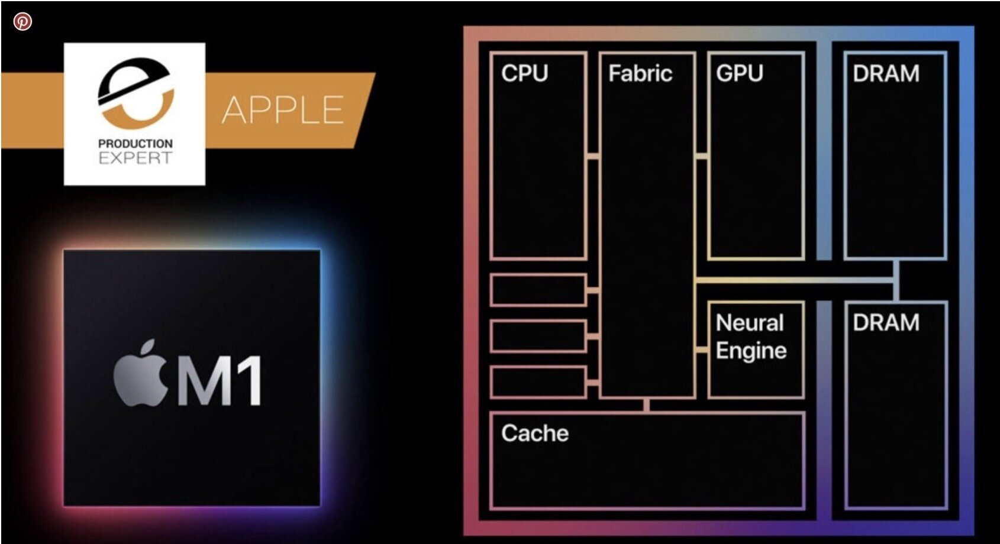

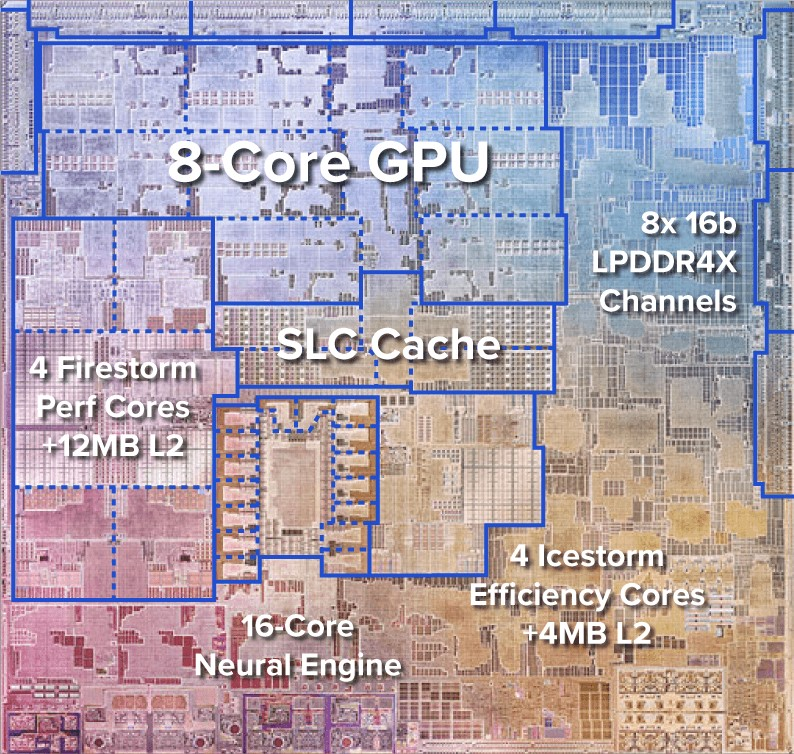

## 一生一芯SoC介绍

> #### info::一生一芯SoC资料
> 目前本节讲义的内容参考了第四期一生一芯的SoC工程，更多相关信息请浏览[第四期一生一芯计划仿真用SoC工程](https://github.com/OSCPU/ysyxSoC)

一生一芯的SoC系统中包括了处理器核，CPU选择模块、UART、SPI、VGA、SDRAM、PS2、ETHMAC和Chiplink等外设。

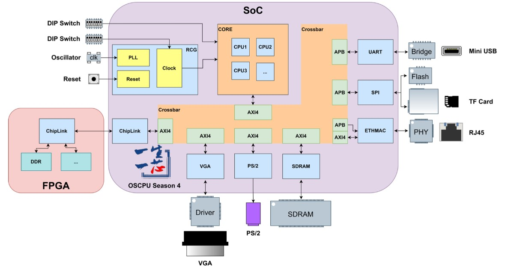

### PCB板
PCB 板分为上下两层，分别为SoC板和FPGA板，上下板之间通过Chiplink连接。

SoC板包括SoC芯片、晶振、8位拨码开关等元件。

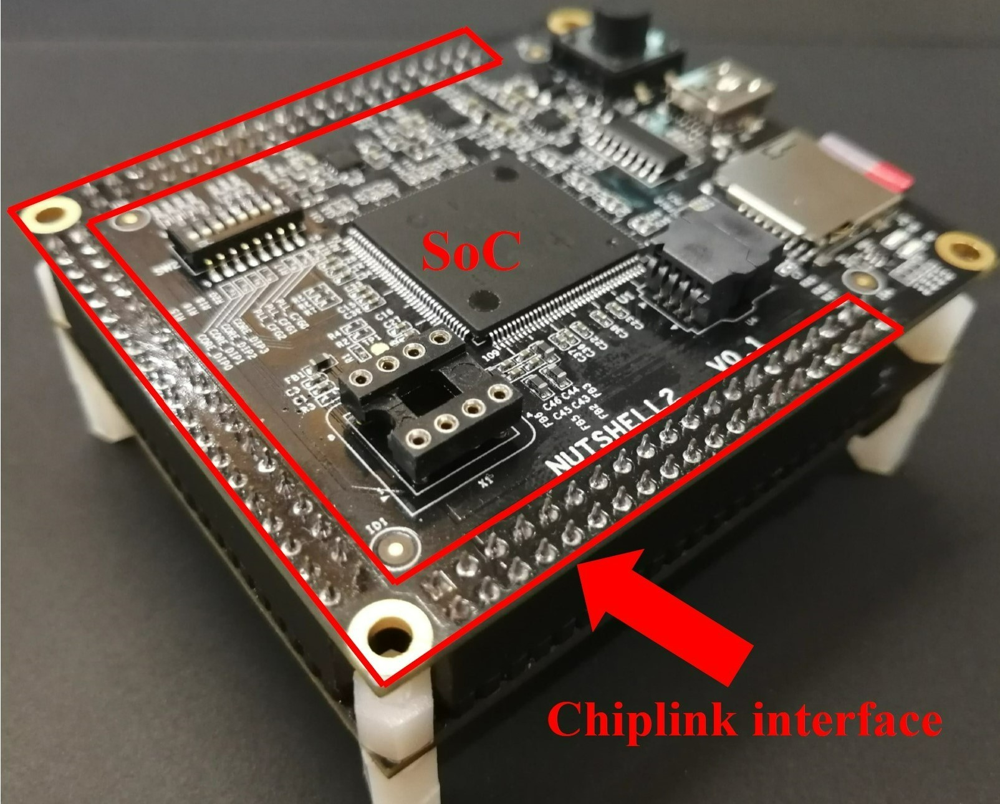

出于成本的考量，多个同学的CPU会被集成到一块SoC上，根据拨码开关指定选择信号`core_dip`，在实际芯片中选择其中一个CPU运行。

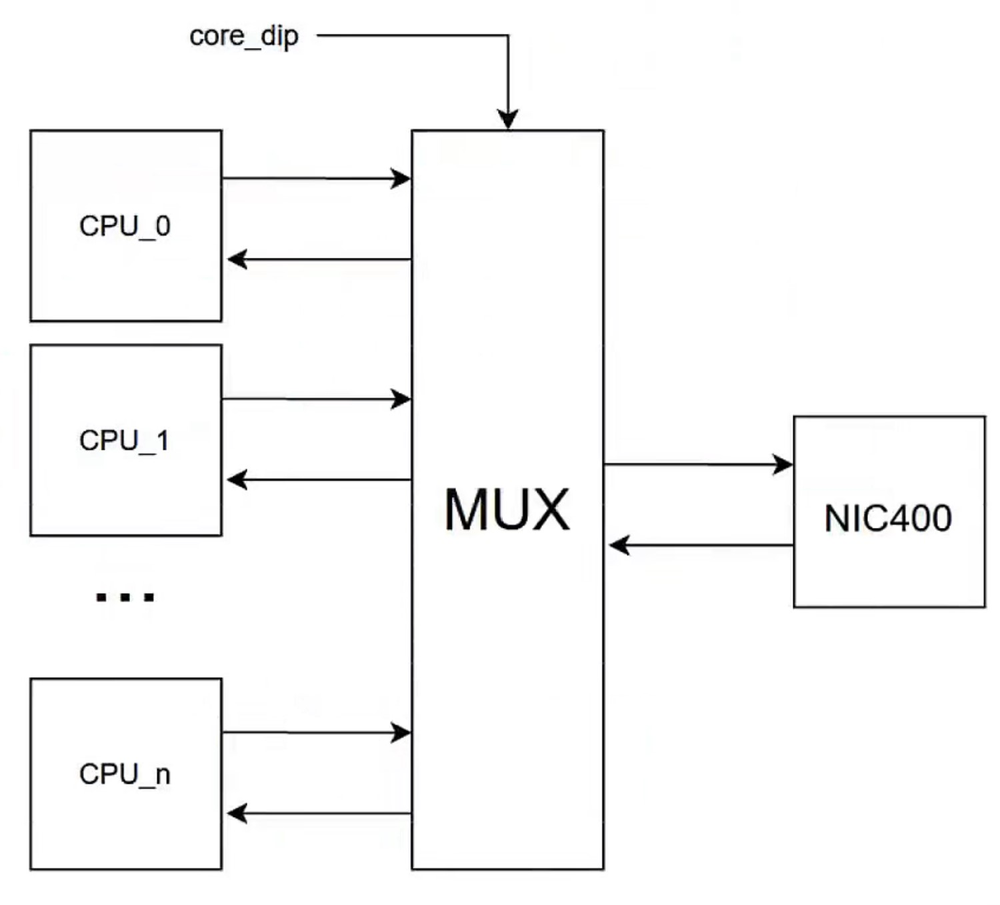

晶振为各种外设提供25MHZ的时钟。
为将低频的晶振时钟倍频到更高的频率输入给CPU使用，处理器集成了PLL（锁相环）模块，上电时通过不同的`pll_cfg`选择CPU使用的频率。

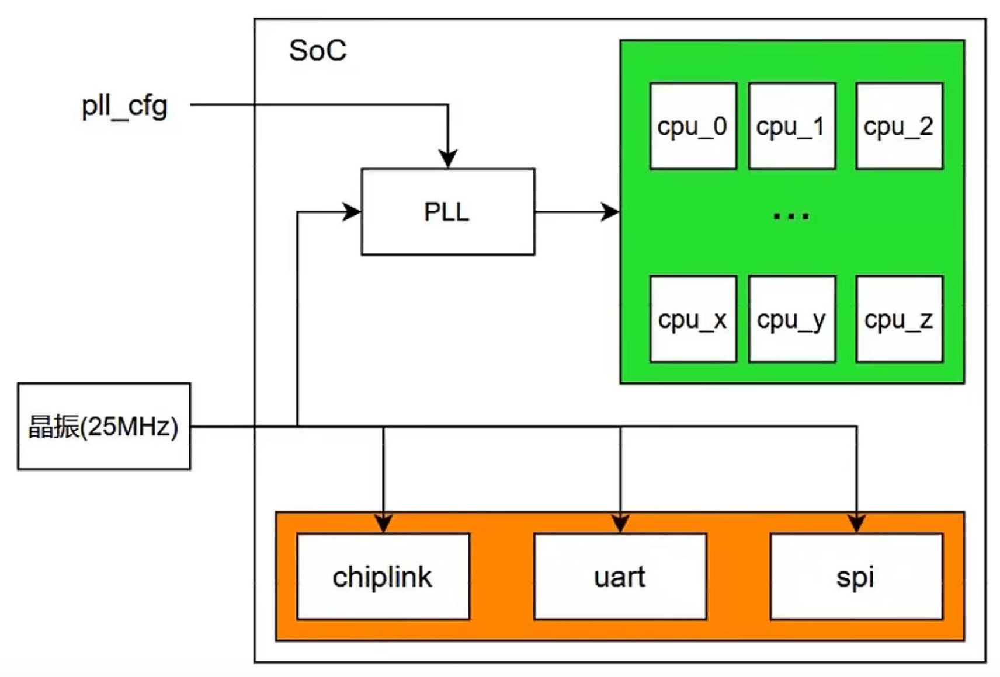

FPGA板包括ZYNQ芯片、DDR等元件。

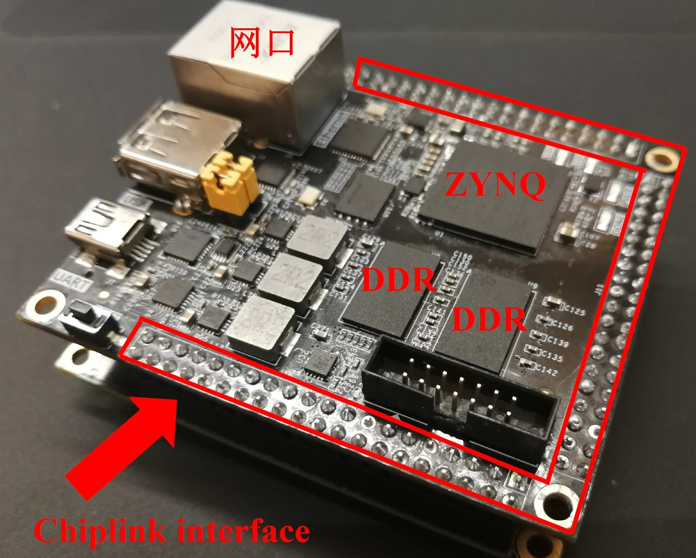

### 外设介绍
* [UART N16550](http://byterunner.com/16550.html)：十分常见的UART IP，在软件上易于配置和使用，可以灵活地配置例如波特率、FIFO、中断等功能。

    初始化UART的流程：
    1. 关闭中断
    2. 配置LC寄存器，以使能divisor latches
    3. 配置波特率
    4. 释放divisor latches
    5. 数据传输

* [SPI FLASH](https://www.fpga4fun.com/SPI.html)：SPI控制器与Flash相连接，读取存储在flash上的程序与数据。我们的PC复位值位于SPI-flash中，第一条指令从flash中取出。
* Chiplink：将芯片与FPGA之间的AXI请求进行分片传输及重新组合，从而实现芯片与FPGA之间的连接。
Chiplink易于验证，可以在保证正确性的前提下提供丰富的外设。
不过，尽管Chiplink有sifive的开源实现，但没有文档；同时Chiplink的带宽很低。

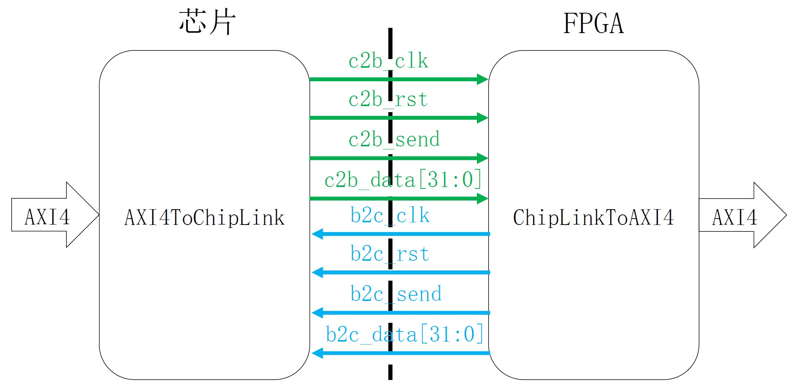

### 仿真测试
SoC团队通过VCS和Verdi对集成后的SoC进行测试，其中VCS用于仿真，Verdi用于调试。

在VCS仿真测试框架中，`asic_top`为设计和流片的顶层，即PCB板上的SoC芯片，同时测试框架中还包含了一些其他仿真模块。
在进行仿真测试时，程序被加载进Flash和RAM中。

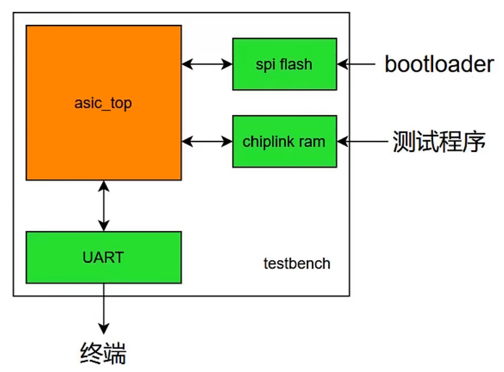

SoC团队采用三种类型的仿真测试。
* RTL仿真：在RTL级别对设计进行仿真，验证设计的功能正确性
* 网表仿真：对综合后的网表进行仿真，验证功能正确性。
* 带时序信息的网表仿真：将时序信息反标到网表上进行仿真，验证设计的时序与功能正确性。

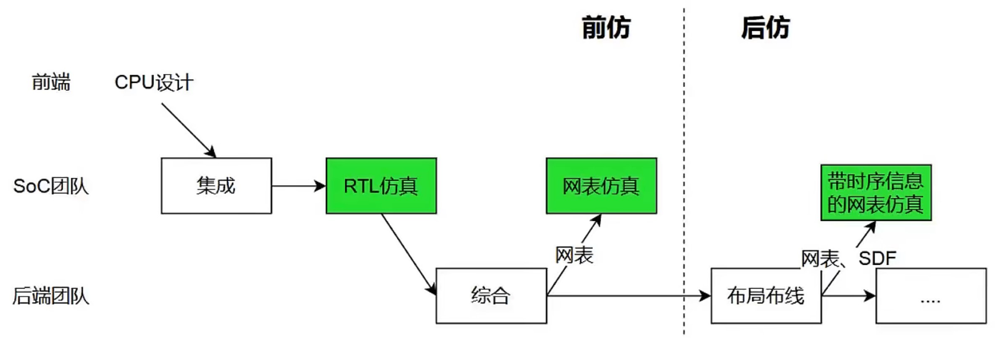

## 一生一芯后端概述
后端设计一般指芯片设计中从网表或RTL代码生成到可生产制造的GDS的设计过程。主要包括综合、形式化验证、布局与布线、以及Signoff阶段的静态时序分析、物理验证等阶段。

* 综合：将RTL通过综合工具、工艺库等生成门级网表代码，为后续布局布线提供必要条件。
通过面积、时序、功能三方面对综合的结果进行评估。

* 形式化验证：比较前后两个电路代码的设计逻辑是否等价，实现数据同参考数据的所有compare point进行比较，得出是否所有点逻辑一致。
当每次网表发生变更时，均需要进行形式化验证。

* 布局与布线：布局主要分为如下两个阶段：
    1. Floorplan：规划芯片的面积，规划电源网络，摆放物理单元等。
    2. Place：摆放综合后的门级网表，进行时序优化，判断是否有足够的绕线资源等。

    布线主要分为如下两个阶段：
    1. CTS：生成实际的时钟树，把时钟信号送到时序单元，使时钟到每个寄存器的延时趋于一致。
    2. Route：通过走线通道完成所有绕线工作，计算实际延迟，判断时序是否满足要求。

* 静态时序分析：通过遍历所有的约束路径，基于时序的最差条件进行时序分析。 
    1. setup检查：保证数据比时钟触发沿提前到达寄存器。
    2. hold检查：让下个时钟触发沿采集的数据不在当前时钟触发沿到达。

* 物理验证：检查是否满足工艺节点可制造的要求。需要验证以下三项内容：
    1. DRC：验证是否满足工艺的设计规则
    2. Antenna Check：排除会产生电荷聚集的点，避免离子注入和刻蚀等工艺的影响，同时避免聚集的电荷破坏击穿薄的氧化绝缘层，导致电路失效。
    3. LVS：保证gds所代表的电路和设计的网表逻辑的一致性，电气性能的正确性。

> #### todo::将自己的CPU核接入SoC环境中
> 目前，第四期一生一芯的仿真用SoC工程已发布，大家可以参考[第四期一生一芯计划仿真用SoC工程](https://github.com/OSCPU/ysyxSoC)以及工程中的说明，
> 将自己的CPU核接入SoC环境中进行测试。
> 当然，可能需要对自己现有的CPU核进行一些修改与兼容。
>
> 在完成A线的其他内容时，你的CPU核可能会有很大改动，所以如果你目前还没有完成A线的其他内容，建议你在完成后再将CPU核接入SoC环境。但是你可以提前看看SoC环境的对接要求和CheckList，对之后要做的事情心中有数。
>
> 我们也十分欢迎大家根据[第四期一生一芯计划仿真用SoC工程](https://github.com/OSCPU/ysyxSoC)搭建自己的仿真用SoC测试平台，后续再根据后端的要求进行修改。

> #### comment::参考资料
> * [计算机体系结构基础 胡伟武等](https://github.com/foxsen/archbase)
> * [第三期一生一芯系列视频](https://www.bilibili.com/video/BV1PU4y1V7X3?p=23&vd_source=38024886289f4efc2c6167eacd5361b7)
> * [第四期一生一芯计划仿真用SoC工程](https://github.com/OSCPU/ysyxSoC)
> * [第五期一生一芯系列视频](https://space.bilibili.com/2107852263/channel/collectiondetail?sid=690279)

