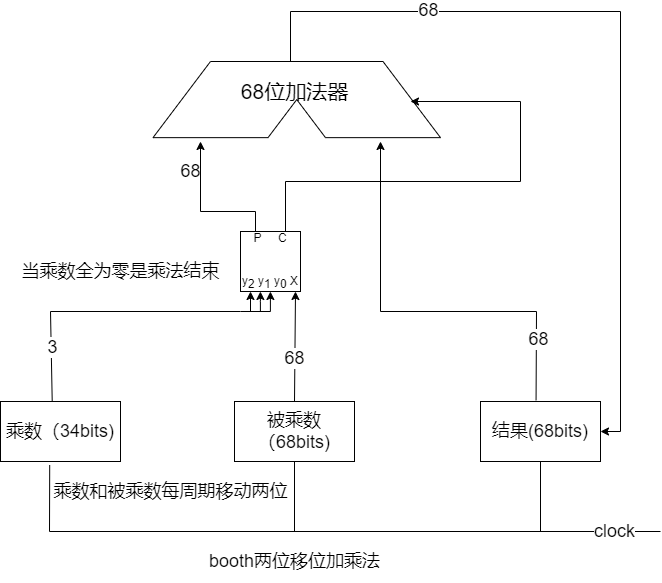
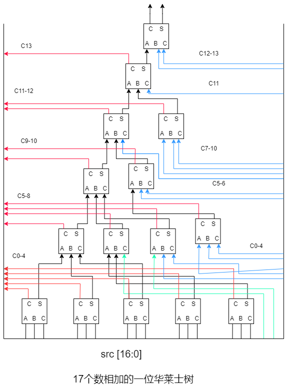
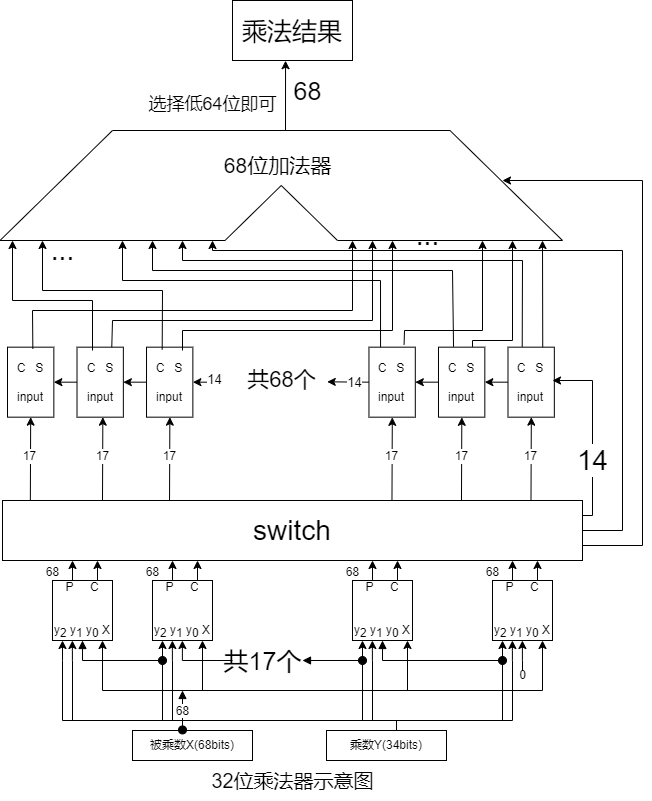
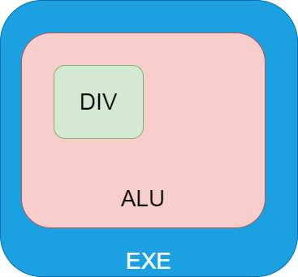

## 乘除法功能单元

> #### info::视频录播和课件
> * 录播 - [功能单元设计](https://www.bilibili.com/video/BV1ET411m7cZ/)
> * 课件 - [功能单元设计](https://ysyx.oscc.cc/slides/2205/20.html#/)

### 概述

出于面积和成本的限制，建议同学们乘除法器各实现两种，可以通过宏定义实现两种乘除法器的切换，一种是简单的移位乘除法器，一种是高性能的乘除法器。高性能是通过面积换时间，而且高性能往往比较复杂，建议大家有时间之后才考虑高性能。

这里建议采用握手方法处理乘除法，方便后续处理流水线，模块替换和总线相关的问题。

### 建议实现的模块接口

除法器模块信号

| 信号       | 方向   | 位宽 | 说明                                                         |
| ---------- | ------ | ---- | ------------------------------------------------------------ |
| clock      | input  | 1    | 时钟信号                                                     |
| reset      | input  | 1    | 复位信号（高有效）                                           |
| dividend   | input  | xlen | 被除数（ xlen 表示要实现的位数，ysyx 中是 64）               |
| divisor    | input  | xlen | 除数                                                         |
| div_valid  | input  | 1    | 为高表示输入的数据有效，如果没有新的除法输入，在除法被接受的下一个周期要置低 |
| divw       | input  | 1    | 为高表示输入的是 32 位除法                                   |
| div_signed | input  | 1    | 表示是不是有符号除法，为高表示是有符号除法                   |
| flush      | input  | 1    | 为高表示要取消除法（修改一下除法器状态就行）                 |
| div_ready  | output | 1    | 为高表示除法器空闲，可以输入数据                             |
| out_valid  | output | 1    | 为高表示除法器输出了有效结果                                 |
| quotient   | output | xlen | 商                                                           |
| remainder  | output | xlen | 余数                                                         |

乘法器端口信号

| 信号         | 方向   | 位宽 | 说明                                                         |
| ------------ | ------ | ---- | ------------------------------------------------------------ |
| clock        | input  | 1    | 时钟信号                                                     |
| reset        | input  | 1    | 复位信号（高有效）                                           |
| mul_valid    | input  | 1    | 为高表示输入的数据有效，如果没有新的乘法输入，在乘法被接受的下一个周期要置低 |
| flush        | input  | 1    | 为高表示取消乘法                                             |
| mulw         | input  | 1    | 为高表示是 32 位乘法                                         |
| mul_signed   | input  | 2    | 2’b11（signed x signed）；2’b10（signed x unsigned）；2’b00（unsigned x unsigned）； |
| multiplicand | input  | xlen | 被乘数，xlen 表示乘法器位数                                  |
| multiplier   | input  | xlen | 乘数                                                         |
| mul_ready    | output | 1    | 为高表示乘法器准备好，表示可以输入数据                       |
| out_valid    | output | 1    | 为高表示乘法器输出的结果有效                                 |
| result_hi    | output | xlen | 高 xlen bits 结果                                            |
| result_lo    | output | xlen | 低 xlen bits 结果                                            |

补充说明：一生一芯中 xlen 为 64

### 乘法器的实现

以两个32位数的乘法为例子

#### 一位移位乘法器（移位加）的实现 

将乘法结果设置为零，并将被乘数存入一个 64 bits 寄存器的低 32 bits 中（非 GPR )，将乘数存入一个 32 bits 寄存器中。

在每个时钟周期判断乘数的最低位，如果是 1，将被乘数的加到结果中；如果乘数的最低位是  0，则不需要加入结果中。然后将乘数右移一位，被乘数左移一位。然后进入到下一个时钟周期

执行 32 次步骤，注意这是补码乘法，最高位为1代表的是负数，所以如果一开始的乘数高位是 1 的话，最后一步需要执行补码减法。最后的结果输出的时候，要把结果有效信号拉高。

##### 支持无符号乘法

我们不仅需要支持有符号乘法，还需要支持无符号乘法，那我们应该怎么支持无符号乘法呢？

1. 分别实例化有符号乘法和无符号乘法模块？
2. 改造一下乘法器让其支持有符号和无符号？

**思考**：这里到底两种方法到底**哪种更好**呢？到底是为什么呢？

下面介绍改造乘法器的方法，我认为有两种比较直接的方法。

1. 把是不是有无符号的乘法的信息记录下来，根据这个信息决定最后一步到底是减法还是加法。
2. 把 32bits 数额外扩展一位符号位，无符号数将这一位置零，有符号数就是根据符号位来扩展。这样可以将无符号数转化成有符号数了。

##### 关于测试

强烈建议大家先单独对乘法模块进行随机测试，功能验证正确后才将乘法器接入到你流水线中。

#### booth两位移位乘法器

Booth乘法器由英国的Booth夫妇提出的，上面的补码乘法器，需要特别地挑出最后一个部分积进行特别处理，有点复杂。而且要计算一个乘法需要 33 个周期（32bits），可以对补码乘法公式进行变换，可以找出更合适硬件实现的乘法。

Booth一位变换，以 8 bits 数为例

$$\begin{align}
&
- y_7 * 2 ^ 7
+ y_6 * 2 ^ 6
+ y_5 * 2 ^ 5
+ y_4 * 2 ^ 4
+ y_3 * 2 ^ 3
+ y_2 * 2 ^ 2
+ y_1 * 2 ^ 1
+ y_0 * 2 ^ 0
\nonumber \\
= &
- y_7 * 2 ^ 7
- y_6 * 2 ^ 6
- y_5 * 2 ^ 5
- y_4 * 2 ^ 4
- y_3 * 2 ^ 3
- y_2 * 2 ^ 2
- y_1 * 2 ^ 1
- y_0 * 2 ^ 0
\nonumber \\ 
&
+ y_6 * 2 ^ 7
+ y_5 * 2 ^ 6
+ y_4 * 2 ^ 5
+ y_3 * 2 ^ 4
+ y_2 * 2 ^ 3
+ y_1 * 2 ^ 2
+ y_0 * 2 ^ 1
\nonumber \\
= &
 (y_6 - y_7) * 2 ^ 7
+ (y_5 - y_6) * 2 ^ 6
+ (y_4 - y_5) * 2 ^ 5
+ (y_3 - y_4) * 2 ^ 4
+ (y_2 - y_3) * 2 ^ 3
+ (y_1 - y_2) * 2 ^ 2
+ (y_0 - y_1) * 2 ^ 1
+ (y_{-1} - y_0) * 2 ^ 0
\end{align}$$

其中 $y_{-1}$ 为 0，经过变换后，公式变得更加工整，更加适合硬件的实现，新公式称为 booth 一位乘算法。

booth一位乘法需要根据乘数的最低两位才能确定如何将被乘数加到结果中，根据公式可以得出如下规则。

（注意：需要在乘数最低位（最右侧）添零）

| $y_i$ | $y_{i-1}$ | 操作                     |
| ----- | --------- | ------------------------ |
| 0     | 0         | 不需要加(+0)             |
| 0     | 1         | 补码加X（$+[X]_补\quad$) |
| 1     | 0         | 补码减X（$-[X]_补\quad$) |
| 1     | 1         | 不需要加（+0）           |

Booth 一位乘法的补码加法器，面积较大，电路延迟较长，限制了硬件乘法器的速度，对补码乘法公式进行变换，得到如下的 booth 两位乘算法（以 8bits 数为例）。

$$\begin{align}
&
- y_7 * 2 ^ 7
+ y_6 * 2 ^ 6
+ y_5 * 2 ^ 5
+ y_4 * 2 ^ 4
+ y_3 * 2 ^ 3
+ y_2 * 2 ^ 2
+ y_1 * 2 ^ 1
+ y_0 * 2 ^ 0
\\ = &
- 2 * y_7 * 2 ^ 6
+ y_6 * 2 ^ 6
+ y_5 * 2 ^ 6
- 2 * y_5 * 2 ^ 4
+ y_4 * 2 ^ 4
+ y_3 * 2 ^ 4
\\ &
- 2 * y_3*y2
+ y_2 * 2 ^ 2
+ y_1 * 2 ^ 2
- 2 * y_1 * 2 ^ 0
+ y_0 * 2 ^ 0
+ y_{-1} * 2 ^ 0
\\ = &
(y_5 + y_6 - 2 * y_7) * 2 ^ 6
+ (y_3 + y_4 - 2 * y_5) * 2 ^ 4
+ (y_1 + y_2 - 2 * y_3) * 2 ^ 2
+ (y_{-1} + y_0 - 2 * y_1) * 2 ^ 0
\end{align}$$

根据 Booth 两位乘算法，需要**每次扫描 3 位**的乘数，并在每次累加完成后，将被乘数和乘数移 2 位。根据算法公式，可以推导出操作的方式。注意被扫描的 3 位是当前操作阶数  i  加 上其左右各 1 位。 (举例子，如果是 8 位的数字，起始位为 0 位。那么 i 就为0，2，4，6)

#### booth两位运算规则

| $y_{i+1}$ | $y_i$ | $y_{i-1}$ | 操作                           |
| --------- | ----- | --------- | ------------------------------ |
| 0         | 0     | 0         | 不需要加（+0）                 |
| 0         | 0     | 1         | 补码加 X（$+[X]_补\quad$)      |
| 0         | 1     | 0         | 补码加 X（$+[X]_补\quad$)      |
| 0         | 1     | 1         | 补码加 2X（$+[X]_补\quad$左移) |
| 1         | 0     | 0         | 补码减 2X（$-[X]_补\quad$左移) |
| 1         | 0     | 1         | 补码减 X（$-[X]_补\quad$)      |
| 1         | 1     | 0         | 补码减 X（$-[X]_补\quad$)      |
| 1         | 1     | 1         | 不需要加（+0）                 |

 Booth 乘法的核心是部分积的生成，共需要生成 N/2 个部分积。每个部分积与 [X]补 相关，总共 有 ‑X、‑2X、+X、+2X   和 0 五种可能，而其中减去 [X]补 的操作，可以视作加上按位取反的 [X]补 再末位加 1。  

假设$[X]_补\quad$的二进制格式可以写成$x_7x_6x_5x_4x_3x_2x_1x_0$假设部分积P等于$p_7p_6p_5p_4p_3p_2p_1p_0+c\quad$可以有如下情况

|         |            | 选择      |
| ------- | ---------- | --------- |
| $p_i$== | ~$x_i$     | 选择  -x  |
|         | ~$x_{i-1}$ | 选择  -2x |
|         | $x_i$      | 选择  +x  |
|         | $x_{i-1}$ | 选择  +2x |
|         | 0          | 选择  0   |

当部分积的选择为 2X 时，可以视作 X 输入左移 1 位，此时 $p_i$就与 $x_{i-1}$ 相等。如果部分积的选择 是 ‑X  或者 ‑2X，则此处对  $x_i$  或者  $x_{i-1}$ 取反，并设置最后的末位进位  c  为  1。  

#### 结果选择逻辑

根据卡诺图分析可以得到每一位 $p_i$ 的表达式

$$p_i = \sim \left[\quad \begin{align}
   & \sim (S_{-x} ~~~~\&~~~~ \sim x_i     &) \\
\& & \sim (S_{-2x}~~~~\&~~~~ \sim x_{i-1} &) \\
\& & \sim (S_{+x} ~~~~\&~~~~ x_i          &) \\
\& & \sim (S_{2x} ~~~~\&~~~~ x_{i-1}      &) \\
\end{align} \quad\right]$$

```verilog
assign p = ~(~(sel_negative & ~x) & ~(sel_double_negative & ~x_sub) 
           & ~(sel_positive & x ) & ~(sel_double_positive &  x_sub));
```

#### booth选择信号的生成

```verilog
///y+1,y,y-1///
wire y_add,y,y_sub;
wire sel_negative,sel_double_negative,sel_positive,sel_double_positive;

assign {y_add,y,y_sub} = src;

assign sel_negative =  y_add & (y & ~y_sub | ~y & y_sub);
assign sel_positive = ~y_add & (y & ~y_sub | ~y & y_sub);
assign sel_double_negative =  y_add & ~y & ~y_sub;
assign sel_double_positive = ~y_add &  y &  y_sub;
```

#### Booth部分积生成模块

把上面的结果选择模块和booth信号生成模块封装成一个模块之后你就有了一个部分积生成模块。

建议大家把上面的两个部分别都封装成一个模块，最后再把部分积模块也封装成一个模块。这样你就有了一个部分积生成模块。

#### 移位加实现booth两位乘法（以32bits数为例）

同时支持无符号和有符号乘法

>#### info::思考
>
>1.有符号乘法与无符号乘法有什么区别？
>
>2.怎么让一个乘法模块同时支持有符号和无符号乘法？
>
>3.为什么要把 32 bits 数转换为 34 bits数？ 转换成  33bits 数行吗？


1. 乘法开始的时候需要在乘数的最右边补一个零，把结果全部置零。
2. 将乘数的最低 3bits 和被乘数的 68bits 输入到部分积生成模块，把部分积生成模块生成的数与结果用 68bits 加法器相加，并把和暂存到结果寄存器中，并把乘数右移两位，把被乘数左移两位。
3. 重复上面的步骤，直至 34bits 的乘数全部为零。



注意:由于两位 booth 每次需要扫描三位乘数，此时不能只扩展一位符号位，只能扩展两位符号位。

#### 华莱士树 X booth (以32bits乘法为例）

即使采用了 Booth 两位乘法，使用移位加策略来完成一个 64 位乘法，也需要 32 个时钟周期，并且还不支持流水。由于乘法具有完整的交换律，可以通过面积换时间的方式，将各个部分积并行的加在一起，而非串行迭代累加。

> #### info::思考
>
> 1.乘法和除法有什么不同？
>
> 2.除法器有没有类似于华莱士树一样的能完全并行的计算方法？

##### 缺少的模块

我们之前已经完成了 booth两位 的部分积模块。所以我们目前只差两个关键模块。

**第一个switch模块**

其作用类似于矩阵的转置，在 32bits（扩展成 34bits )乘法中是将 17 个 68bits 部分积转换成 68 个 17bits 数，其实这个模块就是纯连线没有额外的元件。

**第二个模块是17bits华莱士树。**

17bits 华莱士树共有6层，使用了15个全加器。



```verilog
//一位全加器
module csa(
  input [2:0] in,
  output cout,s

);
wire a,b,cin;
assign a=in[2];
assign b=in[1];
assign cin=in[0];
assign s = a ^ b ^ cin;
assign cout = a & b | b & cin | a & cin;
endmodule
```

| 信号       | 方向   | 描述                                                         |
| ---------- | ------ | ------------------------------------------------------------ |
| src_in     | input  | 输入的 17bits 数据                                           |
| cin        | input  | 来自右边华莱士树的进位输入，最右边的华莱士树的 cin 是来自 switch 模块 |
| cout_group | output | 输入到左边的华莱士树的进位输出，最左边的华莱士树的忽略即可   |
| cout       | output | 输出到加法器的 src1                                          |
| s          | output | 输出到加法器的 src2                                          |


```verilog
module walloc_17bits(
    input [16:0] src_in,
    input [13:0]  cin,
    output [13:0] cout_group,
    output      cout,s
);
wire [13:0] c;
///////////////first////////////////
wire [4:0] first_s;
csa csa0 (.in (src_in[16:14]), .cout (c[4]), .s (first_s[4]) );
csa csa1 (.in (src_in[13:11]), .cout (c[3]), .s (first_s[3]) );
csa csa2 (.in (src_in[10:08]), .cout (c[2]), .s (first_s[2]) );
csa csa3 (.in (src_in[07:05]), .cout (c[1]), .s (first_s[1]) );
csa csa4 (.in (src_in[04:02]), .cout (c[0]), .s (first_s[0]) );

///////////////secnod//////////////
wire [3:0] secnod_s;
csa csa5 (.in ({first_s[4:2]}             ), .cout (c[8]), .s (secnod_s[3]));
csa csa6 (.in ({first_s[1:0],src_in[1]}   ), .cout (c[7]), .s (secnod_s[2]));
csa csa7 (.in ({src_in[0],cin[4:3]}       ), .cout (c[6]), .s (secnod_s[1]));
csa csa8 (.in ({cin[2:0]}                 ), .cout (c[5]), .s (secnod_s[0]));

//////////////thrid////////////////
wire [1:0] thrid_s;
csa csa9 (.in (secnod_s[3:1]          ), .cout (c[10]), .s (thrid_s[1]));
csa csaA (.in ({secnod_s[0],cin[6:5]} ), .cout (c[09]), .s (thrid_s[0]));

//////////////fourth////////////////
wire [1:0] fourth_s;

csa csaB (.in ({thrid_s[1:0],cin[10]} ),  .cout (c[12]), .s (fourth_s[1]));
csa csaC (.in ({cin[9:7]             }),  .cout (c[11]), .s (fourth_s[0]));

//////////////fifth/////////////////
wire fifth_s;

csa csaD (.in ({fourth_s[1:0],cin[11]}),  .cout (c[13]), .s (fifth_s));

///////////////sixth///////////////
csa csaE (.in ({fifth_s,cin[13:12]}   ),  .cout (cout),  .s  (s));

///////////////output///////////////
assign cout_group = c;
endmodule
```

注意：最左边的华莱士树的 cout 不接入到最后的加法器的 src1 中，src1 的最低位来自 switch 的输出，然后剩下的高67bits，来自除了最左边华莱士树的的cout.

下面是 32 bits walloc X booth的示意图



#### 时序问题

上面的移位加乘法每个周期只需计算部分内容，移位加乘法器基本不会成为处理器的关键路径，所以暂时不需要考虑这部分的时序问题，处理器的瓶颈主要是在访存（包括取指），大家可以先考虑优化访存部件。

现代处理器通常可以实现全流水、4 个时钟周期延迟的定点乘法指令。如果使 walloc X booth 乘法器单周期输出结果，会极大的拖累处理器的频率，我建议大家该乘法器进行流水切分。其实流水切分也很简单，只需要向流水线处理器那样插入级间寄存器，并稍微加入几个握手的控制信号即可。

以上参考资料[《计算机体系结构基础（第三版》](https://foxsen.github.io/archbase/运算器设计.html#定点补码乘法器)，《CPU设计实战》

### 除法器实现

由于除法不具备完全交换律，并且除法也往往不是处理器性能的瓶颈。这里建议大家先实现一个radix-2除法器就行。如果想实现radix-4和radix-16除法器，可以参考 [香山](https://github.com/OpenXiangShan/XS-Verilog-Library/tree/main/int_div_radix_4_v1) 或者这篇 [论文](https://ieeexplore.ieee.org/document/1432667) 。

#### 一位恢复余数绝对值迭代除法器

除法器依据是否将源操作数转换为绝对值分成绝对值除法器和补码除法器。绝对值除法器最后得到的是商和余数的绝对值，最后需要计算一下商和余数的补码；补码除法器最后的结果是补码，但是存在多减多除的情况，需要对余数进行调整。

简单的迭代除法是试商法。 依据迭代过程中，在不够减时（商为 0），是否恢复余数分为：恢复余数法（循环减法），不恢复余数法（加减交替）。 

##### 迭代主要步骤和操作

本除法器为一位恢复余数绝对值迭代除法器。运算主要有三大步。

###### (一) 根据被除数和除数确定商和余数的符号，并计算除数和被除数的绝对值

| 被除数 | 除数 | 商   | 余数 |
| :----: | ---- | ---- | ---- |
|   正   | 正   | 正   | 正   |
|   正   | 负   | 负   | 正   |
|   负   | 正   | 负   | 负   |
|   负   | 负   | 正   | 负   |

对于无符号数，计算机存的数就是其源码，因此绝对值不需要变换。对于有符号正数，存的是补码但是其补码等于源码，对于有符号数负数，存的是补码，对齐取反加一后可得到绝对值。总结：只有有符号负数需要调整。

###### (二) 迭代运算得到商和余数的绝对值

1. **将被除数前面补32个0， 记为A[63:0]，记除数为B[31:0]，得到的商记为S[31:0]， 余数即为 R[31:0] .**
2. **第一次迭代，取 A 的高 33 位，即 A[63:31]，与 B 高位补 0 的结果{1’b0,B[31:0]}做减法：如 果结果为负数，则商的相应位(S[31])为 0，被除数保持不变；如果结果为正数，则商的相应 位记为 1，将被除数的相应位(A[63:31])更新为减法的结果。**
3. **随后进行第二次迭代，此时就需要取 A[62:30]与{1’b0,B[31:0]}作减法，依据结果更新 S[30]， 并更新 A[62:30]。** 
4. **依此类推，直到算完第 0 位。** 

第3点中，依次取不同位置的33位数，在硬件上不太方便实现，可以考虑每周期把被除数的寄存器左移一位，由于移动的位数固定，相当于直接用连线实现。

###### (三) 调整最终商和余数

需要根据上面的表格进行调整，有符号数的绝对值转换为有符号数

此文章参考《CPU设计实战》第五章


> #### todo::在NPC中实现可配置的乘除法器
> * 运行仙剑奇侠传，验证自己的乘除法器。

### 关于直接写 ”*“ 和 ”/“

Q: 可以直接写  ”*“ 和 ”/“ 吗 ？

A: 这个是可以的，建议在搭建单周期 NPC 、流水框架和验证乘除法模块功能的时候使用。最后提交用于流片的代码中就不能直接写  ”*“ 和 ”/“。

Q: 验证乘除法模块的怎么使用 ”*“ 和 ”/“  ？

A: 如果你写的是 test bench的话，可以就像在C语言中直接用使用即可，这里有 32 bits 的[除法模块的test bench]( https://github.com/markaulunGH/alu/blob/master/div_model/base_div/div_tb.v) 和 32 bits 的 [乘法模块的 test bench](https://github.com/markaulunGH/alu/blob/master/mul_model/base_mul/mul_tb.v) 

### 多周期乘除法器接入流水线

由于部分同学是新接触流水暂停，在这里给出一点接入的小建议，如果同学们有更好更通俗易懂的方法也欢迎在我们的 [讨论区](https://ysyx.oscc.cc/login?from=%2Fredirect%2Fforum%2F)  讨论。

多周期除法器不能在一个周期内计算出结果，在接入顺序流水后，在除法结果未计算完成的时候需要将流水线暂停。

#### 除法器模块部分控制信号

| 信号      | 方向   | 位宽 | 说明                                                         |
| --------- | ------ | ---- | ------------------------------------------------------------ |
| div_valid | input  | 1    | 为高表示输入的数据有效，如果没有新的除法输入，在除法被接受的下一个周期要置低 |
| div_ready | output | 1    | 为高表示除法器空闲，可以输入数据                             |
| out_valid | output | 1    | 为高表示除法器输出了有效结果                                 |

#### 除法器模块在流水线中的位置



#### ALU中增加的信号

| 信号      | 类型 | 位宽 | 说明                                                       |
| --------- | ---- | ---- | ---------------------------------------------------------- |
| div_valid | wire | 1    | 输入除法器的 div_valid 信号                                |
| dv_ready  | wire | 1    | 来自除法器的 div_ready 信号                                |
| out_valid | wire | 1    | 来自除法器的 out_valid  信号                               |
| div_doing | reg  | 1    | 为高表示除法器正在计算                                     |
| op_div    | wire | 1    | 来自 ID 与 EXE 的级间寄存器输出，为高表示 EXE 的指令是除法 |
| alu_busy  | wire | 1    | 表示 ALU 正忙，需要阻塞流水线                              |

````verilog
/*除法器接受数据之后到下一个除法到来之前，div_valid都应该是零*/
assign div_valid = op_div && !div_doing && !out_valid;
/*在除法期间，out_valid 不为高表示计算结果还为得出，ALU正忙，需要阻塞流水*/
assign alu_busy  = op_div && !out_valid;
````

```verilog
always @(posedge clk) begin
    if (reset) begin
        div_doing <= 1'b0;
    end
    /*除法结果输出后需要将div_doing置零*/
    else if (out_valid) begin
      div_doing <= 1'b0;
    end
    /*握手成功后，也就是除法器接受输入的数据后需要把div_doing置高*/
    else if(div_valid && div_ready) begin
      div_doing <= 1'b1;
    end
end
```

上面就是一个简单的控制逻辑，建议将除法器和ALU封装成上图中的模块，这样层次比较分明，便于实现和维护。

#### 更多问题

1.`out_valid`为高时到底会维持几个周期呢？如果只维持一个周期（我也是比较建议是维持一个周期），就需要考虑当除法计算完成并把结果输出完毕之后,流水级的`MEM`和`WB`模块在某些情况下也会把流水线暂停的情况，这个时候如果不进行处理的话，会导致严重的错误。那么我们该怎么处理呢？这个也比较简单，我们需要增加一些寄存器把除法结果和除法已经计算完成的信息存储下来，并修改对应的`alu_busy`等信号就可以实现了。

2.多周期乘除法器可不可以采用非握手方法接入流水线？

