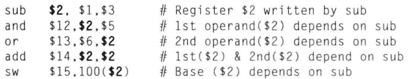

## 流水线处理器

> #### info::视频录播和课件
> * 录播 - [流水线处理器](https://www.bilibili.com/video/BV1zM411t7Q3/)
> * 课件 - [流水线处理器](https://ysyx.oscc.cc/slides/2205/21.html#/)

在此之前，你已经实现了单周期处理器，为了提高主频我们需要实现处理器的流水化，以下将提供五级流水线的实现思路与实现步骤作为参考。

流水线的实现划分为以下几个小阶段：
* 实现不考虑相关性冲突，不考虑跳转指令的流水线
* 考虑跳转指令
* 解决指令相关性冲突
* 在流水线中添加更多部件

如果你从来没有接触过流水线的实现，可以根据上面提到的几个小阶段来逐步实现流水线，避免在同一时间产生大量bug。如果你已经接触过流水线了，你可以按照自己的思路来做，并在实现流水线后跑通之前的所有测试。

## 介绍流水线的基本概念

> #### info::参考资料
>
> * 《CPU设计实战》第四章。
> * 《计算机组成与设计 硬件软件接口（第五版）》第四章中关于流水线的部分。
> * [Build your pc](https://zanpu.spencerwoo.com/3_Pipelining/3-3_Hazards.html#data-hazard-%E2%80%94%E2%80%94-%E6%95%B0%E6%8D%AE%E5%86%B2%E7%AA%81)
> * 《计算机体系结构-量化研究方法（第六版）》附录c。

## 实现不考虑相关性冲突，不考虑跳转指令的流水线

五级流水线将处理器划分为五个部分：取指级、译码级、执行级、访存级、写回级。每个流水线的功能如下：
* 取指级（IF）：取指令，输出next_pc。
* 译码级（ID）：译码，分配功能，获取源操作数。
* 执行级（EXE）：执行指令，计算结果。
* 访存级（MEM）：执行内存读写指令。
* 写回级（WB）：写回结果。

我们知道将电路流水线化的初衷是缩短时序器件之间组合逻辑关键路径的时延，在不降低电路处理吞吐率的情况下提升电路的时钟频率。从电路设计最终的实现形式来看,是将一段组合逻辑按照功能划分为若干阶段，在各功能阶段的组合逻辑之间插入时序器件（通常是寄存器），前一阶段的组合逻辑输出接入时序器件的输入,后一阶段的组合逻辑输入来自这些时序器件的输出。

同样处理器的每一级流水线之间也要插入寄存器来保持级间数据，这些寄存器称为流水线寄存器，这里给出一个流水线寄存器的命名规则：取指级和译码级之间的流水线寄存器记作“ID reg”，其他的同理。

流水线寄存器保存的内容分为两类，控制内容和数据内容。控制内容只有一个1比特的valid信号，用于表示当前流水线寄存器中保存的值是否为有效的。数据内容需要根据各个流水级的输出信号来考虑，为了方便debug这里建议将PC和INST加入到各级流水线寄存器的数据内容中。另外，流水线寄存器中的所有寄存器都要定义为带有enable的寄存器（当enable为true时寄存器的输入有效，否则寄存器保持原值），这在流水线的阻塞中将会用到。

> #### todo::实现不考虑相关性冲突，不考虑跳转指令的流水线
>
> 我们先考虑最简单的情况，也就是没有跳转指令，且没有指令相关性冲突的情况。
> * 考虑各级流水线寄存器需要保持哪些数据内容。
> * 编写rtl代码实现最简单的流水线。
> * 写一个简单的测试用例来看看流水线的实现是否正确。（测试用例中不包括跳转指令，且不存在指令相关性冲突）

## 实现考虑跳转指令的流水线

现在需要考虑跳转指令了。跳转指令的计算可以放到译码级（也就是说在译码级就计算出是否需要跳转以及跳转的地址），然后将跳转信号连接到取指级让其生成正确的next_pc。

> #### todo::实现考虑跳转指令的流水线
>
> * 在流水线中正确处理跳转指令。
> * 写一个简单的测试用例来看看跳转指令是否能被正确执行。（测试用例中不存在指令相关性冲突）

## 解决指令相关性冲突

指令相关性冲突有三种RAW、WAR和WAW，由于现在的流水线是顺序执行的，所以只会出现RAW冲突（read after write，写后读冲突）。

关于相关性冲突的原理可以参考《计算机组成与设计 硬件软件接口（第五版）》中4.7章的内容。以下是一个RAW冲突的例子，后四条指令需要在第一条指令完成写入后才能正确读出$2的值。

要解决指令相关性冲突的问题首先要检测流水线中是否存在指令相关性冲突。我们需要在译码级检查当前的流水线是否存在指令相关性冲突，更具体一点，我们需要依次检查处于执行级的指令、处于访存级的指令、处于写回级的指令是否与处于译码级的指令发生相关性冲突。

在检测到流水线存在指令相关性冲突后，我们要如何解决这个问题呢？答案是流水线阻塞。这里介绍一个流水线阻塞的实现思路。假设我们要阻塞执行级，也是说执行级、译码级和取指级“停住”，访存级和写回级可以继续“流动”。要实现这个效果需要：
* MEM reg的valid的输入为false，其他级的流水线寄存器的valid的输入为上一级的流水线寄存器的valid的输出。
* ID reg和EXE reg的enable置为false，MEM reg和WB reg的enable置为true。

如果你对此感到疑惑，你可以通过打草稿的方式来进行验证。回到最开始的问题，我们如何解决指令相关性冲突？答案是当检测到存在指令相关性冲突时我们需要阻塞译码级直到相关性冲突消失。

> #### todo::解决指令相关性冲突
>
> * 实现指令相关性冲突的检测电路。
> * 实现流水线的阻塞。
> * 跑通所有cpu_test测试用例。

另外，你也可以为每一个流水线寄存器添加一个名为flush的控制端口，当flush为true时，流水线寄存器将在下一个时钟上升沿清空该流水线寄存器中保存的值。

## 在流水线中添加更多部件

你已经有了流水线的知识基础，并学会了如何处理跳转指令和阻塞流水线。现在带着这些学到的知识、思路和技巧来为流水线添加更多的部件吧。

> #### todo::为流水线添加乘法器和除法器
>
> * 在流水线中添加乘法器和除法器。
> * 跑通所有测试用例。
> * 运行仙剑奇侠传，验证自己的乘除法器。

> #### todo::为流水线添加中断异常机制。
>
> * 在流水线中添加中断异常机制。
> * 跑通所有测试用例。
> * 运行仙剑奇侠传，验证自己的中断异常机制。

> #### todo::为流水线添加总线和Cache。
>
> * 在流水线中添加总线和Cache。
> * 跑通所有测试用例。
> * 运行仙剑奇侠传，验证自己的总线和Cache。

