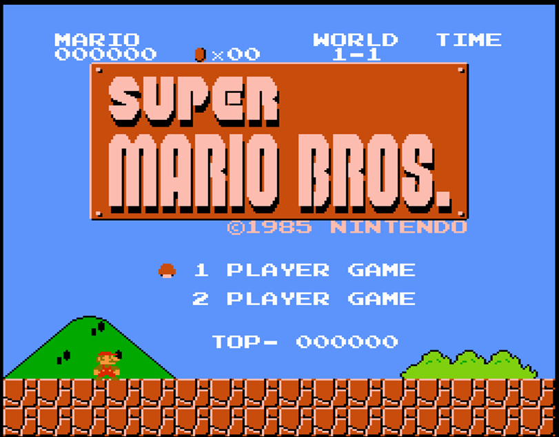

# 基础(B)阶段概述

基础(Baseline)阶段是"一生一芯"的第一个正式学习的阶段.
B阶段的目标有两个
* 在自己设计的处理器上运行红白机游戏超级玛丽
* 深入理解超级玛丽是如何在自己设计的处理器上运行的

具体来说, B阶段的任务又可以分成如下部分:
1. 搭建基础设施. 基础设施是指提升调试效率的工具和方法.
如果你已经听说过第三期"一生一芯"的DiffTest(差分测试)机制,
相信你也大概能够明白基础设施对于一个有一定规模的项目来说多么的重要了.
除了DiffTest之外, 你还会实现简易调试器和各种trace(踪迹)工具,
这些基础设施将会伴随你整个"一生一芯"的学习:
即使到了A阶段和S阶段, 你会发现它们仍然可以大幅提升调试的效率;
甚至可以说, 如果没有这些基础设施, 你想要在S阶段中存活下来, 将要付出巨大的代价.
1. 设计一个支持RV32E的单周期处理器.
不过你会首先实现一个RV32IM(对, 是RV32IM)的模拟器,
在不接触RTL实现细节的情况下理解RISC-V指令和程序的行为,
然后再把这些理解迁移到RTL实现的真实处理器中.
1. 为单周期处理器添加输入输出功能.
这样以后, 你就可以在自己设计的处理器上运行超级玛丽了.
1. 实现简单的异常处理机制, 运行RT-Thread操作系统
1. 实现总线, 接入SoC
1. 将处理器改成流水线结构

> #### caution::工具不是会用就行了吗? 为什么我要花那么多时间去写工具?
> 如果你真心抱有这样的疑问, 你大概率还不理解"使用正确的工具解决问题"的意义, 具体可能体现在
> 1. 不会主动寻找正确的工具来提高工作效率(例如通过拷贝的方式来备份项目, 而不是使用版本管理工具)
> 1. 就算会用一些工具, 也不太愿意花点时间深入了解它们的更多功能
> 1. 如果工具是开源的, 也没想过可以添加一些定制化的功能
> 1. 如果没有这样的工具, 更不会想过自己去写一个
>
> 真正明白工具意义的开发者, 是不会觉得这是在浪费时间的:
> 现在花时间去了解/实现工具, 将来就会帮你把时间成倍地赚回来.
